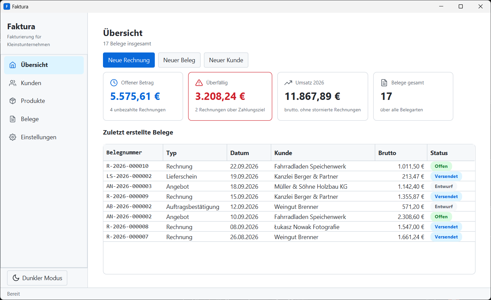
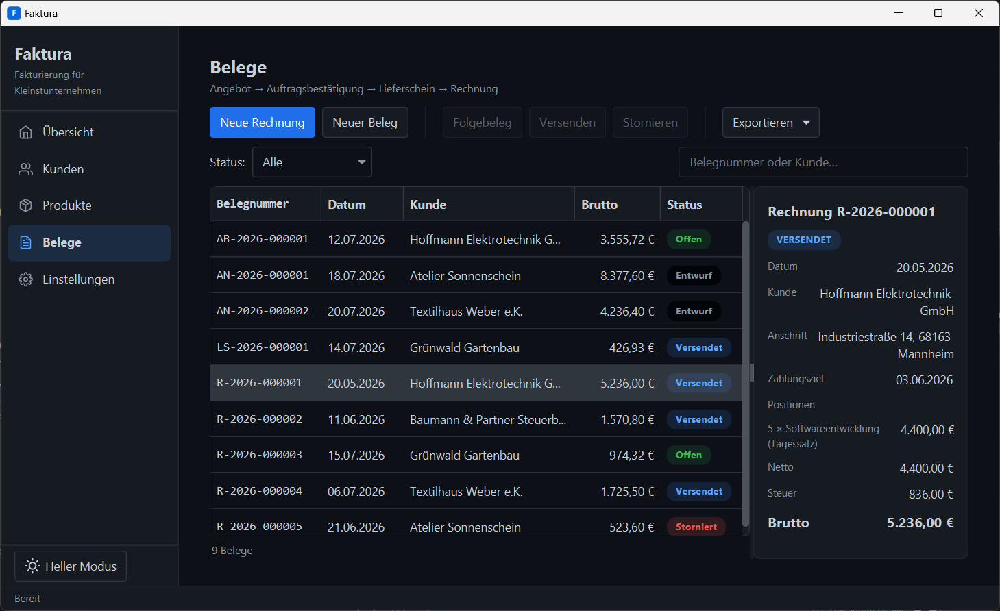
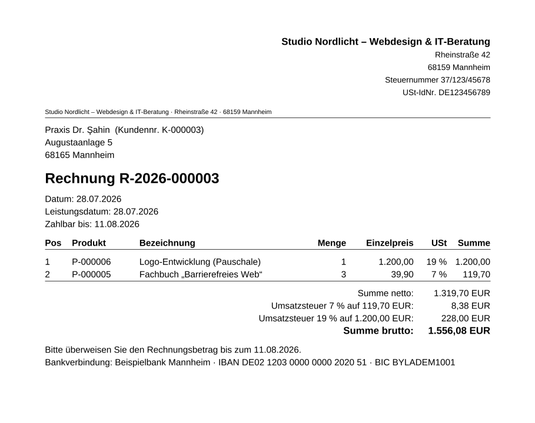

# Faktura

[](https://github.com/lucasstrubel/faktura/actions/workflows/ci.yml)
[](https://github.com/lucasstrubel/faktura/releases/latest)
[](https://adoptium.net/temurin/releases/?version=21)
[](LICENSE)
[](https://claude.com/claude-code)

**Schlanke Desktop-Fakturierung für Freiberufler und Kleinstunternehmen — vollständig lokal,
ohne Cloud, ohne Abo.**

Faktura verwaltet Kunden und Produkte und bildet den vollständigen kaufmännischen
Dokumentenzyklus ab — Angebot → Auftragsbestätigung → Lieferschein → Rechnung —
einschließlich PDF-Ausgabe, E-Rechnung nach EN 16931, lückenloser Rechnungsnummern und
unveränderlicher versendeter Belege (GoBD).

> **Herkunft:** Faktura ist im Rahmen des Moduls **Software Engineering 1** an der
> **TH Mannheim** gestartet (Sommersemester 2026). 12 Studierende in vier Gruppen zu je
> drei Personen haben den vollständigen V-Modell-Prozess durchlaufen — Lastenheft,
> Pflichtenheft, Entwurf, Modultest, Abnahme —, jede Gruppe mit einer der vier Komponenten.
> Ich habe dabei das Repository verwaltet und sämtliche Projektdokumente verfasst. Seit
> Projektabschluss entwickle ich Faktura allein zu einer auslieferbaren Anwendung weiter.

📄 **[Fallstudie lesen](dokumentation/projekt/Fallstudie.md)** ([PDF](dokumentation/pdf/Fallstudie.pdf))
— das Compliance-Problem hinter der Fachlichkeit, die fünf Entscheidungen, die es tragen,
warum jeder Umbauschritt nötig war und was ich unterwegs gelernt habe.

## Funktionen

- **Kunden- und Produktverwaltung** — Anlegen, Ändern, Suchen, Löschen mit vergebenen
  Nummern (`K-000017`, `P-000042`) und Löschsperre: Stammdaten, die in Belegen verwendet
  werden, lassen sich nicht löschen
- **Dokumentenzyklus** — jeder Beleg lässt sich aus seinem Vorgänger ableiten; Preise,
  Kunde und Aussteller werden als unveränderlicher Snapshot gespeichert, spätere
  Stammdatenänderungen verändern keine bestehenden Belege
- **Geführte Rechnungserstellung** — Assistent in fünf Schritten (Kunde → Positionen →
  Daten → Prüfen → Speichern)
- **Rechtssicher aufgebaut** — lückenlose Rechnungsnummern je Jahr (`R-2026-000124`),
  transaktional abgesichert; Belege werden nie gelöscht; versendete Rechnungen werden
  über eine **Stornorechnung** korrigiert; Pflichtangaben nach § 14 UStG einschließlich
  Steuernummer und **Umsatzsteuer je Steuersatz**; Geldbeträge durchgängig `BigDecimal`
- **Zahlungseingang** — bezahlte Rechnungen verschwinden aus offenem Betrag und
  Überfälligkeit; die Übersicht zeigt Offenes, Überfälliges und den Jahresumsatz
- **Ausgabe** — PDF (Apache PDFBox, eingebettete Schrift), **E-Rechnung nach EN 16931**
  (ZUGFeRD/XRechnung-CII über Mustang, Stornorechnung als korrigierte Rechnung),
  CSV-Export (UTF-8, Excel-tauglich), Druck und E-Mail über das Betriebssystem
- **Nur lokal** — SQLite-Datenbank im Benutzerverzeichnis, Schema über Flyway, Sicherung
  per Knopfdruck als ZIP; keine Netzwerkzugriffe (DSGVO)

## Bildschirmfotos

Die Übersicht beantwortet die drei Fragen, für die man die Anwendung öffnet: Was ist offen,
was ist überfällig, was wurde in diesem Jahr berechnet?



Belege als Master-Detail, dunkles Erscheinungsbild. Die Aktionen richten sich nach dem
Status: Diese Rechnung ist bezahlt, deshalb sind *Versenden*, *Bezahlt* und *Stornieren*
gesperrt — die Ausgabe bleibt verfügbar:



Rechnung als PDF, mit Steuernummer im Briefkopf und Umsatzsteuer je Steuersatz:



*Alle gezeigten Daten sind erfundene Demodaten.*

## Download und Start

**Windows-Installer (MSI):** unter
[Releases](https://github.com/lucasstrubel/faktura/releases/latest) herunterladen —
installiert je Benutzer ohne Administratorrechte, mit Startmenü-Eintrag und eigener
Java-Laufzeit.

**JAR (Windows, Linux, macOS mit Apple Silicon):** `faktura-3.0.0.jar` aus demselben
Release laden und mit Java 21 oder neuer starten:

```bash
java -jar faktura-3.0.0.jar
```

Die Daten liegen unter `<Benutzerverzeichnis>/Faktura/daten`. Ein anderes Verzeichnis
lässt sich beim Start angeben:

```bash
java -jar faktura-3.0.0.jar --faktura.daten-verzeichnis=/pfad/zu/daten
```

Vor der ersten Rechnung unter **Einstellungen** das Firmenprofil hinterlegen — Name,
Anschrift und Steuernummer oder USt-IdNr. stehen auf jedem Beleg.

## Aus dem Quellcode bauen

Voraussetzung ist nur ein **JDK 21 oder neuer** (etwa
[Temurin 21](https://adoptium.net/temurin/releases/?version=21)). Maven lädt der
enthaltene Maven-Wrapper selbst, JavaFX kommt als gewöhnliche Maven-Abhängigkeit.

```bash
git clone https://github.com/lucasstrubel/faktura.git
cd faktura

./mvnw test        # alle Tests (JUnit 5)
./mvnw verify      # Tests + Abdeckungsschwelle + SpotBugs (wie die CI)
./mvnw package     # ausführbares JAR unter target/

java -jar target/faktura-3.0.0.jar
```

Unter Windows ohne Git Bash `mvnw.cmd` statt `./mvnw` verwenden. Ein Release entsteht durch
einen Versions-Tag (`git tag v3.0.0 && git push origin v3.0.0`): Der Workflow prüft Tag und
Projektversion, baut MSI und JAR und veröffentlicht beide.

## Technik

Java 21 · Spring Boot · JavaFX + AtlantaFX + Ikonli · SQLite + Spring JDBC + Flyway ·
Apache PDFBox · Mustang (EN 16931) · Jackson · SLF4J/Logback · Maven · JUnit 5 ·
JaCoCo (Build bricht unter der Abdeckungsschwelle ab) · SpotBugs · GitHub Actions ·
jpackage

## Architektur

Vier fachliche Komponenten — entsprechend den vier Gruppen des ursprünglichen
Projektteams — und zwei Querschnittspakete, verdrahtet über den Spring-IoC-Container:

| Paket | Komponente | Verantwortung |
|-------|------------|---------------|
| `dokumente` | A | Dokumentenzyklus, Belegnummern, Zahlungseingang, Stornorechnung, PDF, E-Rechnung |
| `produkte`  | B | Produktverwaltung (CRUD, Nummernvergabe, Löschsperre) |
| `kunden`    | C | Kundenverwaltung (CRUD, Nummernvergabe, Löschsperre) |
| `gui`       | D | JavaFX-Oberfläche (FXML-Ansichten, Spring-injizierte Controller, Rechnungsassistent) |
| `gemeinsam` | — | Ereignisbus, Validierung, Nummernkreis, CSV, Datensicherung, Ausnahmen |
| `firma`     | — | Firmenprofil des Ausstellers (Briefkopf, Steuerkennung, Bankverbindung) |

Tragende Muster: Repository-Schnittstellen mit SQLite-Implementierung (JSON bleibt für die
einmalige Übernahme und als Sicherungsformat); Nummernvergabe in derselben Transaktion wie
das Speichern; Ereignisse an die Oberfläche erst nach dem Commit; Löschsperre über
Referenzprüfungs-Schnittstellen zwischen den Komponenten; Dialogführung in GUI-freien,
testbaren Controller-Klassen.

Quellcode: [`src/main/java/de/lucasstrubel/faktura/`](src/main/java/de/lucasstrubel/faktura/) ·
Tests: [`src/test/java/de/lucasstrubel/faktura/`](src/test/java/de/lucasstrubel/faktura/)

## Qualität

- **201 automatisierte Tests** (164 Testmethoden), alle grün; zur Abnahme der Version 1.0
  waren es 71
- **Abdeckungsschwelle im Build:** 85 % Anweisungen, 70 % Zweige im nicht-grafischen Code
- **SpotBugs:** keine Befunde, im Build erzwungen
- **Performance als Test:** 5.000 Kunden, 5.000 Produkte, 1.000 Belege gegen die
  Grenzwerte des Lastenhefts (Start ≤ 5 s, Suche ≤ 1 s, PDF ≤ 2 s)
- **Nachvollziehbarkeit:** jede Anforderung ist im
  [Anforderungsabgleich](dokumentation/anforderungen/Anforderungsabgleich.md) auf Code und
  Testfall abgebildet

## Dokumentation

Die vollständige Software-Engineering-Dokumentation liegt unter
[`dokumentation/`](dokumentation/) — als Markdown und als PDF:

| Dokument | Inhalt | PDF |
|----------|--------|-----|
| [Lastenheft](dokumentation/anforderungen/Lastenheft.md) | Anforderungen aus Sicht des Auftraggebers (Version 1.0) | [PDF](dokumentation/pdf/Lastenheft.pdf) |
| [Pflichtenheft](dokumentation/anforderungen/Pflichtenheft.md) | Systemanforderungen, Teile A–D, fortgeschrieben bis Version 3.0 | [PDF](dokumentation/pdf/Pflichtenheft.pdf) |
| [Anforderungsabgleich](dokumentation/anforderungen/Anforderungsabgleich.md) | Traceability-Matrix Anforderung ↔ Code ↔ Test | [PDF](dokumentation/pdf/Anforderungsabgleich.pdf) |
| [Modultestplan](dokumentation/tests/Modultestplan.md) | Testfälle der Version 1.0 und aller Ergänzungen | [PDF](dokumentation/pdf/Modultestplan.pdf) |
| [Modultestbericht](dokumentation/tests/Modultestbericht.md) | Abnahmetest 1.0 und Nachtest 3.0 | [PDF](dokumentation/pdf/Modultestbericht.pdf) |
| [Projektübersicht](dokumentation/projekt/Projektuebersicht.md) | Ziele, Verlauf, Roadmap, offene Punkte | [PDF](dokumentation/pdf/Projektuebersicht.pdf) |
| [Fallstudie](dokumentation/projekt/Fallstudie.md) | Entscheidungen und Erkenntnisse der Weiterentwicklung | [PDF](dokumentation/pdf/Fallstudie.pdf) |
| [Abschlusspräsentation](dokumentation/projekt/Praesentation.md) | Foliensatz der Abnahme im Modul SE1 (historischer Stand 1.0) | [PDF](dokumentation/pdf/Praesentation.pdf) |

Die UML-Diagramme (PlantUML-Quellen und PNG) liegen unter
[`dokumentation/diagramme/`](dokumentation/diagramme/). Die PDFs erzeugt
`tools/dokumentation-bauen.ps1` mit pandoc und XeLaTeX (Präsentation mit Marp).

## Roadmap

Erledigt:

- [x] **Qualitäts-Baseline** — Validierung, Logging, CI mit Abdeckung und statischer Analyse
- [x] **Spring Boot** — IoC-Container statt manueller Verdrahtung, Ereignisse für die Oberfläche
- [x] **SQLite** — Spring JDBC und Flyway hinter den bestehenden Repository-Schnittstellen
- [x] **JavaFX** — vollständiger Neubau der Oberfläche mit Seitennavigation, Übersicht, Dunkelmodus
- [x] **E-Rechnung** — EN 16931 (ZUGFeRD-CII), Firmenprofil, Datensicherung
- [x] **Auslieferung** — Windows-Installer und plattformübergreifendes JAR per Release-Workflow
- [x] **Rechtssicherheit** — transaktionale Nummernvergabe, Stornorechnung, Zahlungseingang,
      Steuer je Steuersatz, Aussteller-Snapshot

Offen:

- [ ] Usability-Test mit fünf Personen (einziges Abnahmekriterium, das Code nicht belegen kann)
- [ ] Steuerbefreiungen und Kleinunternehmerregelung (§ 19 UStG) mit Pflichthinweis
- [ ] Mahnwesen
- [ ] Installationspakete für Linux und macOS

## Mit Claude entwickelt

Faktura ist mit [Claude Code](https://claude.com/claude-code) als Werkzeug entstanden, und es
erscheint mir redlicher, das zu sagen, als es offen zu lassen. Das Werkzeug hat die
mechanische Masse übernommen — paketweite Umbauten, Repository- und Service-Gerüste,
Testgerüste, PlantUML-Quellen, Entwürfe der Spezifikationen, die systematische Fehlersuche.
Die Entscheidungen lagen bei mir: welche Regeln Invarianten sind, dass die Nummernvergabe in
die Transaktion gehört, was aus Version 1.0 bleibt und was verschwindet, und ob eine Änderung
wirklich fertig war. Jede Änderung musste dieselben Hürden nehmen — Tests,
Abdeckungsschwelle, SpotBugs —, und alles Sichtbare wurde durch Starten und Hinsehen geprüft.

Wo das gut funktioniert hat und wo nachgebessert werden musste, beschreibt die
[Fallstudie](dokumentation/projekt/Fallstudie.md#arbeiten-mit-claude-code).

## Lizenz

Entwickelt von **Lucas Strubel**, veröffentlicht unter der [MIT-Lizenz](LICENSE). Die
eingebettete Schrift Liberation Sans steht unter der SIL Open Font License
([Lizenztext](src/main/resources/schrift/LICENSE-LiberationSans.txt)).
