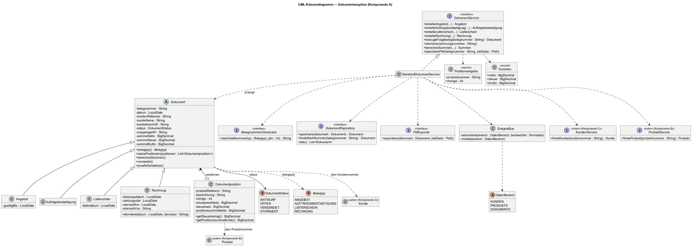
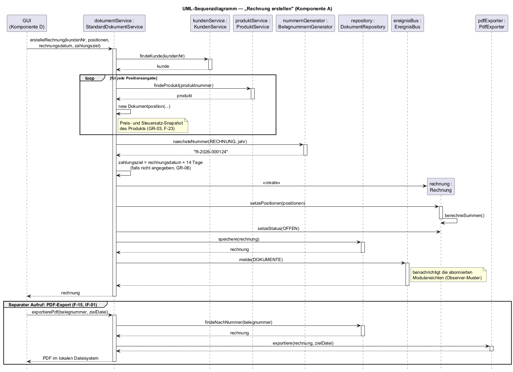
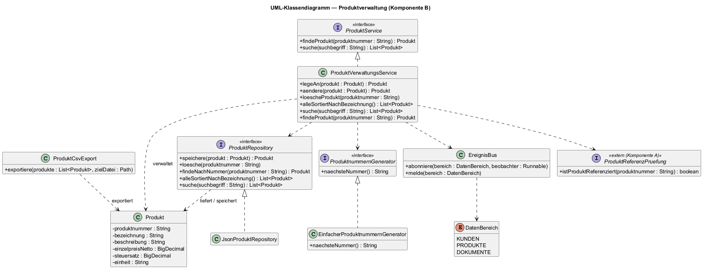
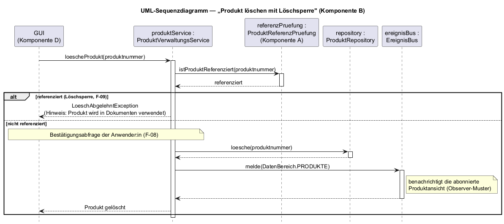
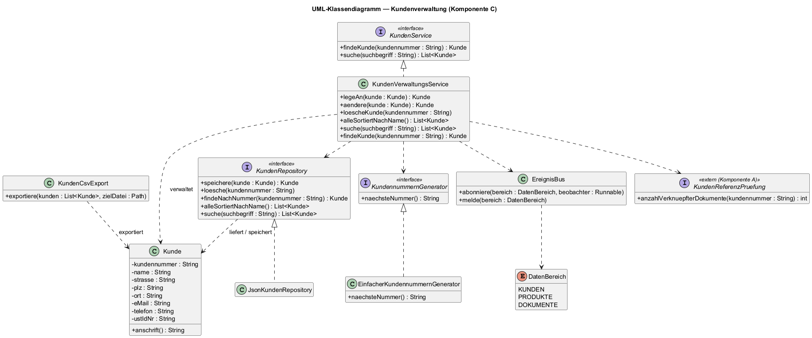
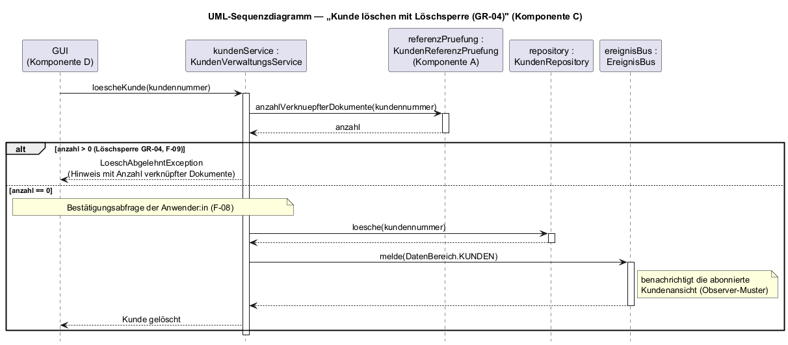
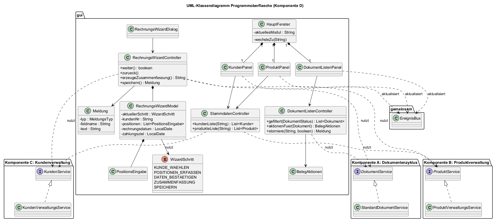
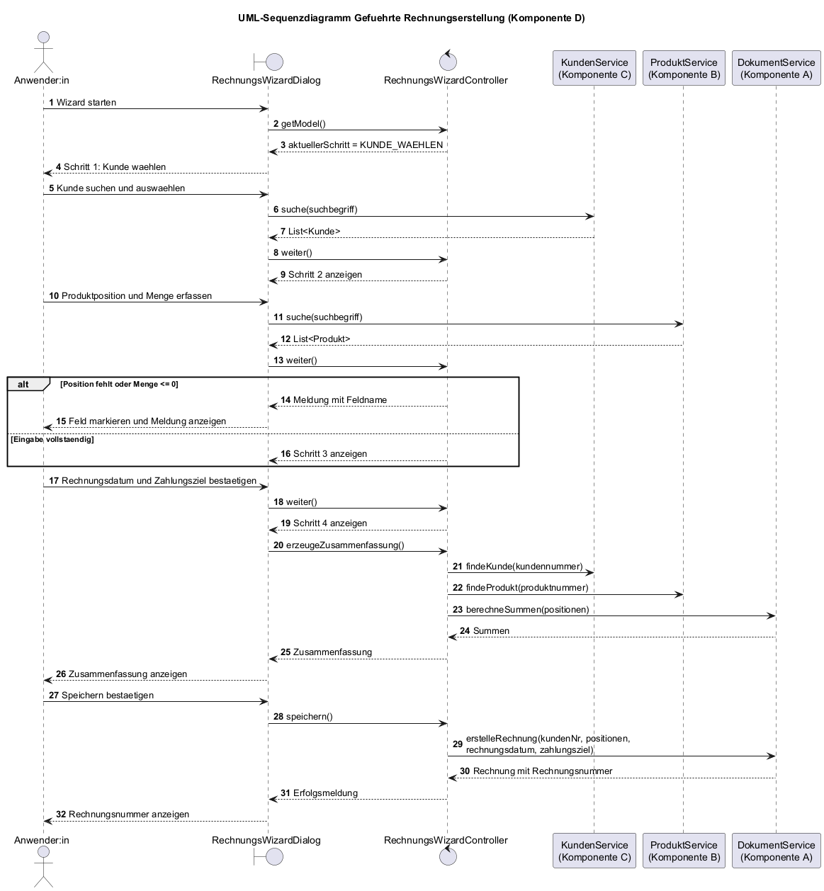

\newpage

## Dokumentenhistorie

| Version | Datum      | Grund der Änderung  |
|---------|------------|---------------------|
| 1.x     | 06/2026    | Vier komponentenspezifische Pflichtenhefte (A: Dokumentenzyklus, B: Produkte, C: Kunden, D: Programmoberfläche) im Rahmen des Hochschulprojekts |
| 2.0     | 18.07.2026 | Konsolidierung der vier Pflichtenhefte zu einem Gesamtdokument |

\newpage

## Einführung

### Zweck des Dokuments

Dieses Pflichtenheft (System Requirements Specification, SRS) beschreibt aus Sicht des
Auftragnehmers, **wie** die Desktop-Fakturierungsanwendung *Faktura* die Anforderungen
des Lastenhefts (v1.3) erfüllt. Es konkretisiert die fachlichen Anforderungen in testbare
Systemanforderungen und dient als direkte Grundlage für Design, Implementierung und die
Modultests.

Die Anwendung ist in **vier fachliche Komponenten** gegliedert, die jeweils in einem
eigenen Teil dieses Dokuments spezifiziert sind:

| Komponente | Teil | Verantwortung |
|------------|------|---------------|
| A | Prozess / Dokumentenzyklus | Belegerzeugung, Belegnummern, Statusführung, PDF-Export |
| B | Verwaltung von Produkten   | Produktstammdaten (CRUD, Nummernvergabe, Löschsperre) |
| C | Verwaltung von Kunden      | Kundenstammdaten (CRUD, Nummernvergabe, Löschsperre GR-04) |
| D | Programmoberfläche         | Navigation, Listen/Formulare, Rechnungs-Wizard, Meldungen |

### Lesart der Anforderungs-IDs

Anforderungs-IDs (`F-…`, `NF-…`, `AC-…`, `TC-…`) gelten **je Komponente**: Innerhalb
eines Teils sind sie unpräfixiert (z. B. `F-12`), komponentenübergreifende Verweise —
auch im Quellcode — tragen den Komponenten-Präfix (z. B. `A-F-12`, `C-F-06`, `B-F-10`,
`D-F-03`). Kapitelverweise innerhalb eines Teils (z. B. „Kapitel 6.2") beziehen sich auf
die Kapitel desselben Teils. IDs aus dem Lastenheft (`BA-…`, `GR-…`, `Q-…`, `PZ-…`)
sind global eindeutig.

### Referenzen

- Lastenheft „Desktop-Fakturierungsanwendung", Version 1.3, 09.06.2026
- § 14 UStG — Pflichtangaben einer Rechnung
- GoBD — Grundsätze zur ordnungsmäßigen Führung und Aufbewahrung von Büchern
- DSGVO — EU-Verordnung 2016/679

## Systemüberblick

Die Anwendung ist eine **Einzelplatz-Stand-Alone-Desktop-Anwendung** mit **lokaler
Datenhaltung** (keine Cloud, kein Server). Die Bedienung erfolgt über eine grafische
Benutzeroberfläche (Komponente D), über die die gesamte Funktionalität zugänglich ist:
Stammdatenpflege für Kunden und Produkte, der vollständige Dokumentenzyklus Angebot →
Auftragsbestätigung → Lieferschein → Rechnung, die geführte Rechnungserstellung als
Wizard sowie PDF-Export und CSV-Datenexport. Erzeugte Belege werden lokal als **PDF**
exportiert und können optional gedruckt oder per Standard-E-Mail-Client versendet werden.

## Stakeholder und Kontext

Stakeholder und Systemkontext sind im Lastenheft (§ 2, § 3) beschrieben und gelten
unverändert. Maßgeblicher Akteur ist die **Anwender:in** — eine natürliche Person
(Selbstständige:r, Freiberufler:in, Kleinstunternehmer:in) ohne technische
Vorkenntnisse (PZ-03), die Stammdaten und Dokumentenzyklus eigenverantwortlich pflegt.
Angrenzende Systeme: lokales Dateisystem (Persistenz, PDF, CSV-Export), optional Drucker
und Standard-E-Mail-Client. Da Kundendaten **personenbezogene Daten** im Sinne der DSGVO
sind, gilt die lokale Datenhaltung (Q-06) in besonderem Maße.

\newpage

# Teil A — Prozess / Dokumentenzyklus

Dieser Teil spezifiziert die Erzeugung, Verknüpfung und Statusführung der vier
kaufmännischen Belegtypen (Angebot, Auftragsbestätigung, Lieferschein, Rechnung), die
geführte Rechnungserstellung sowie die Rechnungsstornierung. Der zugehörige
Modultestplan ist als eigenständiges Dokument (*Modultestplan.md*) geführt.

## 4. Funktionale Anforderungen

Die Anforderungen sind nach Belegtyp gruppiert und mit einheitlichen Satzschablonen
formuliert. Jede Anforderung ist eindeutig, vollständig, widerspruchsfrei und verifizierbar.

> **Belegnummern (übergreifend, GR-01):** Belegnummern sind **eindeutig** und werden
> **vom System generiert** (nicht durch den Anwender eingegeben). Sie werden als
> `String` geführt, **nicht** als `int`, weil die Nummern ein festes Format mit
> führenden Nullen und Präfix besitzen (z. B. `R-2026-000124`); ein ganzzahliger Typ
> würde führende Nullen verlieren. Pro Belegtyp wird ein eigener, fortlaufender und
> **lückenloser** Zähler auf Basis der höchsten bisher vergebenen Nummer geführt.
> Präfixe: `AN-` (Angebot), `AB-` (Auftragsbestätigung), `LS-` (Lieferschein),
> `R-` (Rechnung).

### 4.1 Angebot (aus BA-09)

**F-01:** Das System MUSS es der Anwender:in ERMÖGLICHEN, ein Angebot für einen
existierenden Kunden mit mindestens einer Position aus dem Produktkatalog zu erstellen.

**F-02:** WENN ein Angebot gespeichert wird, DANN MUSS das System eine eindeutige
Angebotsnummer (Präfix `AN-`), das Erstelldatum und ein Gültigkeitsdatum setzen.

**F-03:** Das System MUSS für jedes Angebot die Netto-, Steuer- und Bruttosumme automatisch
aus den Positionen berechnen (siehe F-23).

**F-04:** Das System MUSS es ERMÖGLICHEN, ein gespeichertes Angebot als PDF in das lokale
Dateisystem zu exportieren.

### 4.2 Auftragsbestätigung (aus BA-10)

**F-05:** Das System MUSS es ERMÖGLICHEN, eine Auftragsbestätigung zu erstellen, wobei
Kunde, Positionen und Mengen aus einem vorhandenen Angebot übernommen werden können
(siehe F-22).

**F-06:** WENN eine Auftragsbestätigung gespeichert wird, DANN MUSS das System eine
eindeutige AB-Nummer (Präfix `AB-`) vergeben und — sofern aus einem Angebot erzeugt — eine
Rückreferenz auf das Angebot speichern.

**F-07:** Das System MUSS es ERMÖGLICHEN, eine Auftragsbestätigung als PDF zu exportieren.

### 4.3 Lieferschein (aus BA-11)

**F-08:** Das System MUSS es ERMÖGLICHEN, einen Lieferschein mit Lieferdatum, Positionen
und Liefermengen zu erstellen; Kunde und Positionen können aus einer Auftragsbestätigung
übernommen werden (siehe F-22).

**F-09:** WENN ein Lieferschein gespeichert wird, DANN MUSS das System eine eindeutige
Lieferscheinnummer (Präfix `LS-`) vergeben und — sofern aus einer Auftragsbestätigung
erzeugt — eine Rückreferenz speichern.

**F-10:** Das System MUSS es ERMÖGLICHEN, einen Lieferschein als PDF zu exportieren.

### 4.4 Rechnung (aus BA-12)

**F-11:** Das System MUSS es ERMÖGLICHEN, eine Rechnung für einen Kunden mit mindestens
einer Position zu erstellen.

**F-12:** WENN eine Rechnung gespeichert wird, DANN MUSS das System eine fortlaufende,
lückenlose Rechnungsnummer (Präfix `R-`) auf Basis der höchsten bisher vergebenen Nummer
vergeben (GR-01).

**F-13:** Das System MUSS in jeder Rechnung die Pflichtangaben gemäß § 14 UStG führen:
Rechnungsnummer, Rechnungsdatum, Leistungsdatum, Kundendaten, Positionen mit Einzel- und
Gesamtbeträgen, Steuersatz und Steuerbetrag sowie Netto-, Steuer- und Bruttosumme.

**F-14:** WENN bei der Rechnungserstellung kein abweichendes Zahlungsziel angegeben ist,
DANN MUSS das System ein Standard-Zahlungsziel von **14 Kalendertagen** ab Rechnungsdatum
setzen (GR-06).

**F-15:** Das System MUSS es ERMÖGLICHEN, eine Rechnung als PDF zu exportieren.

### 4.5 Geführte Rechnungserstellung (aus BA-13)

**F-16:** Das System MUSS es ERMÖGLICHEN, die Rechnungserstellung schrittweise
durchzuführen: (1) Kunde auswählen, (2) mindestens eine Produktposition mit Menge erfassen,
(3) Rechnungsdatum und Zahlungsziel bestätigen, (4) Zusammenfassung prüfen, (5) speichern.

**F-17:** WENN die Schritteingabe abgeschlossen ist, DANN MUSS das System vor dem Speichern
eine **Zusammenfassung** mit Kunde, allen Positionen, Mengen, Netto-/Steuer-/Bruttosumme,
Rechnungsdatum und Zahlungsziel anzeigen.

**F-18:** WENN ein Pflichtfeld fehlt (kein Kunde, keine Position, kein Rechnungsdatum),
DANN MUSS das System das Speichern ablehnen und das fehlende Pflichtfeld benennen (Q-09).

### 4.6 Rechnung stornieren (aus BA-14)

**F-19:** Das System MUSS es ERMÖGLICHEN, eine gespeicherte Rechnung im Status `OFFEN` zu
stornieren.

**F-20:** WENN eine Rechnung storniert wird, DANN MUSS das System ihren Status auf
`STORNIERT` setzen, sie nicht mehr in der Liste offener Rechnungen führen und den Vorgang
mit Datum protokollieren.

**F-21:** WENN eine Rechnung den Status `STORNIERT` hat, DANN MUSS das System jede weitere
inhaltliche Änderung ablehnen.

> **Abgrenzung Stornierung vs. Stornorechnung:** Die In-place-Stornierung (F-19/F-20) ist
> ausschließlich für Rechnungen im Status `OFFEN` zulässig. Eine bereits `VERSENDET`e Rechnung
> wird **nicht** in-place storniert, sondern gemäß F-24 über eine **neue**
> Storno-/Korrekturrechnung korrigiert.

### 4.7 Übergreifende Prozessregeln

**F-22 (Dokumentenzyklus-Konsistenz, GR-05):** WENN ein Beleg aus einem Vorgängerbeleg
erzeugt wird, DANN MUSS das System Kunde, Positionen und Mengen übernehmen und eine
eindeutige Rückreferenz auf den Vorgänger speichern.

**F-23 (Steuer-/Summenberechnung, GR-03):** WENN eine Position gespeichert wird, DANN MUSS
das System Netto-, Steuer- und Bruttobetrag automatisch berechnen, wobei der zum Zeitpunkt
der Belegerstellung gültige Steuersatz und Einzelpreis des Produkts als unveränderlicher
**Snapshot** in der Position abgelegt werden.

**F-24 (Unveränderlichkeit, GR-02 / Q-07):** WENN ein Beleg den Status `VERSENDET` hat,
DANN MUSS das System jede inhaltliche Änderung ablehnen; Korrekturen erfolgen ausschließlich
über neue Belege (Storno-/Korrekturrechnung).

## 5. Nicht-funktionale Anforderungen

**NF-PERF-01 (aus Q-03):** Das System MUSS die Erstellung und den PDF-Export eines beliebigen
Belegtyps INNERHALB VON 2 SEKUNDEN abschließen, bei Belegen mit bis zu 50 Positionen und
einem Datenbestand gemäß Q-01 (bis 5.000 Kunden/Produkte).

**NF-INT-01 (aus Q-07 / GR-02):** Das System MUSS nach dem Status `VERSENDET` einer Rechnung
**jede** inhaltliche Änderung ablehnen; zulässig bleiben ausschließlich Storno- bzw.
Korrekturvorgänge über neue Belege.

**NF-USE-01 (aus Q-05):** Die geführte Erstellung einer vollständigen Rechnung an einen
bestehenden Kunden MUSS von einer erstmaligen Anwender:in OHNE EXTERNE HILFE IN WENIGER ALS
10 MINUTEN im ersten Versuch abgeschlossen werden können (Nachweis durch Usability-Test mit
mind. 5 Testpersonen).

**NF-USE-02 (aus Q-09):** Das System MUSS fehlende Pflichtangaben in den Belegformularen so
markieren und benennen, dass mindestens 80 % der Testpersonen die fehlende Eingabe ohne
externe Hilfe im ersten Korrekturversuch ergänzen können.

**NF-SEC-01 (aus Q-06):** Das System MUSS alle Beleg- und personenbezogenen Daten
ausschließlich lokal im Dateisystem speichern, sodass keine Übertragung an externe Dienste
erfolgt (Nachweis durch Netzwerk-Monitoring während eines repräsentativen Nutzungslaufs).

## 6. Daten und Schnittstellen

Dieses Kapitel ist direkter Input für den Modultestplan (eigenständiges Dokument *Modultestplan.md*). Datentypen werden
bereits als Java-Typen angegeben.

### 6.1 Datenobjekte und Datentypen

**Designgrundsätze:**

- **Geldbeträge** werden als `java.math.BigDecimal` mit **Scale 2** und kaufmännischer
  Rundung (`RoundingMode.HALF_UP`) geführt — **nicht** als `double` (Gleitkomma-Rundungs­fehler
  wären für Beträge unzulässig).
- **Belegnummern** werden als `String` geführt (festes Format mit Präfix und führenden
  Nullen, z. B. `"R-2026-000124"`) — **nicht** als `int`.
- **Datumswerte** werden als `java.time.LocalDate` geführt.
- **Mengen** werden als `int` (Stückzahl) geführt.
- **Steuersätze** werden als Faktor im Typ `BigDecimal` geführt (z. B. `0.19`).

#### `enum DokumentStatus`
`{ ENTWURF, OFFEN, VERSENDET, STORNIERT }`

Bedeutung und Übergänge: `ENTWURF` = Beleg in Erstellung (Initialstatus); `OFFEN` =
gespeichert und gültig; `VERSENDET` = an den Kunden übergeben (ab dann unveränderlich, F-24);
`STORNIERT` = storniert. Zulässige Übergänge: `ENTWURF → OFFEN` (beim Speichern),
`OFFEN → VERSENDET` (Markierung „versendet"), `OFFEN → STORNIERT` (Stornierung, F-19).

#### Klasse `Dokumentposition`
| Attribut          | Java-Typ      | Beschreibung |
|-------------------|---------------|--------------|
| produktReferenz   | `String`      | Produktnummer des referenzierten Produkts (Komponente B) |
| bezeichnung       | `String`      | Snapshot der Produktbezeichnung zum Erstellzeitpunkt |
| menge             | `int`         | Stückzahl (> 0) |
| einzelpreisNetto  | `BigDecimal`  | Snapshot Netto-Einzelpreis (Scale 2) |
| steuersatz        | `BigDecimal`  | Snapshot Steuersatz, z. B. `0.19` |
| positionssummeNetto | `BigDecimal` | `einzelpreisNetto * menge` (Scale 2) |

#### Abstrakte Klasse `Dokument`
| Attribut       | Java-Typ                   | Beschreibung |
|----------------|----------------------------|--------------|
| belegnummer    | `String`                   | eindeutig, vom System generiert |
| datum          | `LocalDate`                | Erstelldatum |
| kundenReferenz | `String`                   | Kundennummer (Komponente C) |
| positionen     | `List<Dokumentposition>`   | mind. 1 Position |
| status         | `DokumentStatus`           | Lebenszyklus-Status |
| vorgaengerNr   | `String` (optional, `null`)| Rückreferenz auf Vorgängerbeleg (GR-05) |
| summeNetto     | `BigDecimal`               | Summe aller Positionssummen (Scale 2) |
| summeSteuer    | `BigDecimal`               | Summe der Steuerbeträge (Scale 2) |
| summeBrutto    | `BigDecimal`               | `summeNetto + summeSteuer` (Scale 2) |

#### Spezialisierungen (erben von `Dokument`)
| Klasse                 | Zusätzliche Attribute (Java-Typ) |
|------------------------|----------------------------------|
| `Angebot`              | `gueltigBis: LocalDate` |
| `Auftragsbestaetigung` | — (nutzt `vorgaengerNr` → Angebot) |
| `Lieferschein`         | `lieferdatum: LocalDate` |
| `Rechnung`             | `leistungsdatum: LocalDate`, `zahlungsziel: LocalDate`, `storniertAm: LocalDate` (optional), `storniertVon: String` (optional) |

### 6.2 Schnittstellen

**Externe Schnittstellen:**

| ID    | Schnittstelle             | Zweck |
|-------|---------------------------|-------|
| IF-01 | Lokales Dateisystem       | Persistenz der Belege, Ablage exportierter PDF-Dokumente |
| IF-02 | Druckersystem (optional)  | Direkter Druck eines Belegs |
| IF-03 | Standard-E-Mail-Client (optional) | Versand eines Belegs als PDF-Anhang |
| IF-04 | Datenexport (CSV)         | Export der Belegdaten als CSV in offenem Format (Q-08) |

**Anforderungen an die externen Schnittstellen** 

**IF-01:** Das System MUSS eine Schnittstelle zum lokalen Dateisystem bereitstellen, die es
ERMÖGLICHT, Belege dauerhaft zu speichern und exportierte PDF-Dokumente abzulegen.

**IF-02:** Das System SOLLTE eine Schnittstelle zum Druckersystem bereitstellen, die es der
Anwender:in ERMÖGLICHT, einen Beleg direkt zu drucken (optional).

**IF-03:** Das System SOLLTE eine Schnittstelle zum Standard-E-Mail-Client bereitstellen, die
es der Anwender:in ERMÖGLICHT, einen Beleg als PDF-Anhang zu versenden (optional).

**IF-04:** Das System MUSS eine Export-Schnittstelle bereitstellen, die es der Anwender:in
ERMÖGLICHT, die Belegdaten in einem offenen Format (CSV) in das lokale Dateisystem zu
exportieren (Q-08).

**Interne Schnittstellen:** Die Schnittstellen werden hier **fachlich** beschrieben 
(Zweck, ausgetauschte Daten, Richtung); konkrete Methodensignaturen
und Datentypen sind dem Komponentenentwurf bzw. dem Modultestplan (eigenständiges Dokument *Modultestplan.md*) vorbehalten.

*Genutzte Schnittstellen (Komponente A ruft auf):*

| Schnittstelle           | Partner   | Richtung | Fachlicher Zweck |
|-------------------------|-----------|----------|------------------|
| Kundenzugriff (lesend)  | Komponente C  | C → A    | Kunde per Kundennummer abrufen; Kundensuche (Name/Nr.) |
| Produktzugriff (lesend) | Komponente B  | B → A    | Produkt per Produktnummer abrufen; Produktsuche |

> Liefert die Stammdatenabfrage keinen Treffer, wird dies dem Aufrufer eindeutig signalisiert
> (kein Treffer).

*Bereitgestellte Schnittstellen (Komponente A wird aufgerufen):*

| Schnittstelle             | Partner   | Richtung | Fachlicher Zweck |
|---------------------------|-----------|----------|------------------|
| Referenzprüfung Kunden    | Komponente C  | A → C    | Anzahl der Belege, die einen Kunden referenzieren (Löschsperre GR-04 / C-F-10) |
| Referenzprüfung Produkte  | Komponente B  | A → B    | Ob ein Produkt in Belegen referenziert ist (Löschsperre B-F-10) |

**Komponenteninterne Dienste (rein A-intern, fachlich beschrieben):**

- **Belegnummernvergabe (GR-01):** liefert je Belegtyp und Jahr die nächste fortlaufende,
  lückenlose Belegnummer im festen Format mit Präfix und führenden Nullen (z. B. `R-2026-000124`).
- **Belegpersistenz (IF-01):** speichert Belege im lokalen Dateisystem, liefert einen Beleg zur
  Belegnummer und alle Belege; Belege werden nie gelöscht (GoBD).
- **PDF-Export (IF-01):** exportiert einen Beleg als PDF in das lokale Dateisystem.
- **Ereignisbenachrichtigung (Observer, Paket `gemeinsam`):** meldet Datenänderungen am
  Belegbestand an abonnierte Modulansichten (Komponente D).

## 7. Systemarchitektur (logisch, grob)

Die Komponente folgt einer einfachen Schichtung: die GUI (Komponente D) ruft den
`DokumentService` (realisiert durch `StandardDokumentService`) auf, der die Fachlogik
kapselt und die Dienste `BelegnummernGenerator`, `KundenService`, `ProduktService` und
`PdfExporter` nutzt. Belege werden über ein `DokumentRepository` im lokalen Dateisystem
persistiert (realisiert als JSON-Ablage). Nach jeder schreibenden Operation meldet der
`DokumentService` die Datenänderung über einen **`EreignisBus`** (Observer-Muster, Paket
`gemeinsam`; `melde(DatenBereich.DOKUMENTE)`); die Modulansichten der Komponente D abonnieren
diesen Bus und aktualisieren sich automatisch.

### 7.1 Klassendiagramm

**Beschreibung zu Abbildung 1:** Das Klassendiagramm zeigt die abstrakte Oberklasse
`Dokument` mit den Spezialisierungen `Angebot`, `Auftragsbestaetigung`, `Lieferschein` und
`Rechnung` (Vererbung). Ein `Dokument` besteht aus einer bis vielen `Dokumentposition`-
Objekten (Komposition zwischen `Dokument` und `Dokumentposition`, Multiplizität `1..*`). Jede
`Dokumentposition` referenziert ein `Produkt` (Komponente B), ein `Dokument` referenziert einen
`Kunde` (Komponente C) — jeweils über die Stammdatennummer (lose Kopplung). Der `DokumentService`
orchestriert die Erstellung und nutzt den `BelegnummernGenerator` (Vergabe lückenloser
Belegnummern), die Schnittstellen `KundenService`/`ProduktService` (Stammdaten), das
`DokumentRepository` (Persistenz der Belege im lokalen Dateisystem), den
`PdfExporter` (PDF-Export) sowie den `EreignisBus` (Benachrichtigung der Modulansichten
nach Datenänderungen, Observer-Muster). Der Status eines Belegs wird über das Enum
`DokumentStatus` abgebildet.



### 7.2 Sequenzdiagramm

**Beschreibung zu Abbildung 2:** Das Sequenzdiagramm stellt den Ablauf *Rechnung erstellen*
dar. Die Anwender:in löst über die GUI (Komponente D)
`erstelleRechnung(kundenNr, positionen, rechnungsdatum, zahlungsziel)` am
`DokumentService` aus (ist `zahlungsziel = null`, greift das Standard-Zahlungsziel). Dieser
ermittelt über `KundenService.findeKunde(...)` und `ProduktService.findeProdukt(...)` die
Stammdaten und legt sie als Snapshot je Position ab (Einzelpreis und Steuersatz, F-23),
fordert vom `BelegnummernGenerator` mit `naechsteNummer(RECHNUNG, jahr)` eine lückenlose
Rechnungsnummer an (GR-01), setzt das Standard-Zahlungsziel (+14 Tage, GR-06) und berechnet
beim Setzen der Positionen die Netto-, Steuer- und Bruttosumme des Belegs (F-23). Anschließend
persistiert er den Beleg über das `DokumentRepository`
und meldet die Änderung über `EreignisBus.melde(DOKUMENTE)` an die abonnierten Modulansichten.
Abschließend wird die gespeicherte `Rechnung` an die GUI zurückgegeben. Der PDF-Export ist ein
**separater** Vorgang (im Diagramm unten dargestellt): über `exportierePdf(...)` lädt der
`DokumentService` den Beleg erneut aus dem `DokumentRepository` und exportiert ihn mittels
`PdfExporter.exportiere(...)` in das lokale Dateisystem (F-15, IF-01).



## 8. Testbare Abnahmekriterien

**AC-A-01 (zu F-01–F-04, NF-PERF-01)** — *Angebot erstellen und exportieren*
Vorbedingung: Ein Kunde und 5 Produkte sind erfasst.
Aktion: Anwender:in erstellt ein Angebot mit 5 Positionen und exportiert es als PDF.
Erwartet: Das Angebot ist mit Angebotsnummer (`AN-…`) und korrekten Summen gespeichert; der
PDF-Export ist in ≤ 2 Sekunden abgeschlossen.

**AC-A-02 (zu F-05–F-07, F-22)** — *Auftragsbestätigung aus Angebot*
Vorbedingung: Ein Angebot liegt vor.
Aktion: Anwender:in erstellt eine Auftragsbestätigung mit Übernahme aller Positionen.
Erwartet: Die AB ist mit eindeutiger Nummer (`AB-…`), übernommenen Positionen/Mengen und
Rückreferenz auf das Angebot gespeichert und als PDF exportierbar.

**AC-A-03 (zu F-08–F-10, F-22)** — *Lieferschein erstellen*
Vorbedingung: Eine Auftragsbestätigung liegt vor.
Aktion: Anwender:in erstellt einen Lieferschein mit Lieferdatum.
Erwartet: Der Lieferschein ist mit eindeutiger Nummer (`LS-…`), Lieferdatum und allen
Positionsdaten gespeichert und als PDF exportierbar.

**AC-A-04 (zu F-11–F-15, F-23)** — *Rechnung mit Pflichtangaben und Standard-Zahlungsziel*
Vorbedingung: Kunde und mind. eine Position liegen vor; letzte Rechnungsnummer = `R-2026-000123`.
Aktion: Anwender:in erstellt eine Rechnung mit Rechnungsdatum 09.06.2026 ohne abweichendes
Zahlungsziel.
Erwartet: Die Rechnung trägt die Nummer `R-2026-000124`, ein Zahlungsziel 23.06.2026
(+14 Tage), alle Pflichtangaben gem. § 14 UStG sowie korrekte Netto-/Steuer-/Bruttosummen.

**AC-A-05 (zu F-16–F-18, NF-USE-01/02)** — *Geführte Rechnungserstellung*
Vorbedingung: Mind. ein Kunde und ein Produkt vorhanden.
Aktion: Anwender:in durchläuft die geführte Erstellung (Kunde → Position+Menge → Datum/
Zahlungsziel → Zusammenfassung → speichern).
Erwartet: Vor dem Speichern erscheint eine Zusammenfassung mit Kunde, Position, Menge,
Summen, Rechnungsdatum und Zahlungsziel; fehlt ein Pflichtfeld, wird das Speichern abgelehnt
und das fehlende Feld benannt.

**AC-A-06 (zu F-19–F-21)** — *Rechnung stornieren*
Vorbedingung: Eine Rechnung im Status `OFFEN` existiert.
Aktion: Anwender:in storniert die Rechnung.
Erwartet: Status wird `STORNIERT`, die Rechnung erscheint nicht mehr in der Liste offener
Rechnungen, der Vorgang ist mit Datum protokolliert; weitere Änderungen werden abgelehnt.

**AC-A-07 (zu F-23, F-24, NF-INT-01)** — *Snapshot und Unveränderlichkeit*
Vorbedingung: Eine Rechnung mit einem Produkt ist erstellt; danach wird der Produktpreis
geändert; eine zweite Rechnung im Status `VERSENDET` existiert.
Aktion: Vergleich der ersten Rechnung mit dem geänderten Produktpreis; Änderungsversuch an
der versendeten Rechnung.
Erwartet: Die erste Rechnung behält den ursprünglichen Preis (Snapshot); der Änderungsversuch
an der versendeten Rechnung wird abgelehnt.

## 9. Traceability LH ↔ PH

Jede für Komponente A relevante Lastenheft-Anforderung ist mindestens einer
Pflichtenheft-Anforderung zugeordnet.

| LH-Anforderung | Beschreibung (LH)                         | PH-Anforderung(en)        |
|----------------|-------------------------------------------|---------------------------|
| BA-09          | Angebot erstellen                         | F-01, F-02, F-03, F-04    |
| BA-10          | Auftragsbestätigung erstellen             | F-05, F-06, F-07, F-22    |
| BA-11          | Lieferschein erstellen                    | F-08, F-09, F-10, F-22    |
| BA-12          | Rechnung erstellen                        | F-11, F-12, F-13, F-14, F-15 |
| BA-13          | Geführte Rechnungserstellung              | F-16, F-17, F-18          |
| BA-14          | Rechnung stornieren                       | F-19, F-20, F-21          |
| GR-01          | Lückenlose Rechnungsnummern               | F-12 (Belegnummern-Regel) |
| GR-02          | Unveränderlichkeit versendeter Dokumente  | F-24, F-21, NF-INT-01     |
| GR-03          | Steuerberechnung (Snapshot)               | F-23, F-03, F-13          |
| GR-05          | Dokumentenzyklus-Konsistenz               | F-22, F-06, F-09          |
| GR-06          | Standard-Zahlungsziel 14 Tage             | F-14                      |
| Q-01           | Datenbestand-Referenzgröße (Lastannahme)  | NF-PERF-01 (Bedingung)    |
| Q-03           | Performance PDF-Erstellung ≤ 2 s          | NF-PERF-01                |
| Q-05           | Usability Ersterstellung Rechnung         | NF-USE-01                 |
| Q-06           | Datensicherheit: 100 % lokale Datenhaltung| NF-SEC-01, IF-01          |
| Q-07           | Unveränderlichkeit versendeter Rechnungen | NF-INT-01, F-24           |
| Q-08           | Datenexport (offenes Format, CSV)         | IF-04                     |
| Q-09           | Pflichtfeldhinweise ≥ 80 %                | NF-USE-02, F-18           |

> Hinweis: GR-04 (Löschsperre für verknüpfte Kunden) liegt in der Verantwortung von
> Komponente C; Komponente A nutzt Kundendaten nur lesend (IF/`KundenService`) und ist von
> dieser Regel betroffen, spezifiziert sie aber nicht.

> Hinweis: Q-02 (Such-/Auflistungs-Performance) betrifft die Module Kunden-/Produktverwaltung
> (Komponenten C/B); Q-04 (Anwendungsstart) ist eine querschnittliche Start-/Integrationsanforderung.
> Beide werden von Komponente A nicht spezifiziert; der Gesamtnachweis erfolgt im team-weiten
> Anforderungsabgleich.


\newpage

# Teil B — Verwaltung von Produkten

Dieser Teil spezifiziert die Verwaltung der Produktstammdaten: Anlegen, Ändern, Löschen
(mit Löschsperre) sowie Suchen und Auflisten von Produkten, einschließlich der Vergabe
eindeutiger Produktnummern, der Validierung der Eingaben und der Bereitstellung der
Produktdaten für den Dokumentenzyklus (Komponente A).

## 4. Funktionale Anforderungen

Die Anforderungen sind nach CRUD-Operationen gruppiert und mit einheitlichen Satzschablonen formuliert. Jede Anforderung ist eindeutig, vollständig, widerspruchsfrei und
verifizierbar.

> **Produktnummern (übergreifend):** Produktnummern sind **eindeutig** und werden
> **vom System generiert** (nicht durch den Anwender eingegeben). Sie werden als
> `String` geführt, **nicht** als `int`, weil die Nummern ein festes Format mit
> Präfix und führenden Nullen besitzen (z. B. `P-000042`); ein ganzzahliger Typ
> würde führende Nullen verlieren. Die Nummer wird fortlaufend auf Basis der höchsten
> bisher vergebenen Nummer ermittelt und ist nach der Vergabe **unveränderlich**.
> Anders als bei Rechnungsnummern (GR-01, Komponente A) besteht keine
> Lückenlosigkeits-Pflicht.

### 4.1 Produkt anlegen (aus BA-05)

**F-01:** Das System MUSS es der Anwender:in ERMÖGLICHEN, ein neues Produkt mit den
Pflichtfeldern Bezeichnung, Netto-Einzelpreis und Steuersatz sowie den optionalen Feldern
Beschreibung und Einheit anzulegen.

**F-02:** WENN ein Produkt gespeichert wird, DANN MUSS das System eine eindeutige
Produktnummer (Präfix `P-`, fortlaufend, führende Nullen) vergeben und anzeigen.

**F-03:** WENN ein Produkt gespeichert wird, DANN MUSS das System die Eingaben validieren:
der Netto-Einzelpreis MUSS größer oder gleich `0.00` sein und der Steuersatz MUSS einem
der zulässigen Werte `{0.00, 0.07, 0.19}` entsprechen; andernfalls MUSS das Speichern
abgelehnt werden.

**F-04:** WENN ein Pflichtfeld fehlt (keine Bezeichnung, kein Einzelpreis, kein
Steuersatz), DANN MUSS das System das Speichern ablehnen und das fehlende Pflichtfeld
benennen (Q-09).

### 4.2 Produktdaten ändern (aus BA-06)

**F-05:** Das System MUSS es der Anwender:in ERMÖGLICHEN, die Felder Bezeichnung,
Beschreibung, Netto-Einzelpreis, Steuersatz und Einheit eines bestehenden Produkts zu
ändern und persistent zu speichern.

**F-06:** WENN ein Produkt geändert wird, DANN MUSS das System sicherstellen, dass
ausschließlich **neue** Dokumente den geänderten Wert verwenden; bereits erstellte
Dokumente bleiben unverändert, da Komponente A Preis und Steuersatz als Snapshot in der
Dokumentposition ablegt (GR-02, GR-03). Die Komponente B speichert ausschließlich den
jeweils aktuellen Stand.

**F-07:** Das System MUSS die Produktnummer nach der Vergabe vor jeder Änderung schützen;
ein Änderungsversuch an der Produktnummer MUSS abgelehnt werden.

### 4.3 Produkt löschen (aus BA-07)

**F-08:** Das System MUSS es der Anwender:in ERMÖGLICHEN, ein nicht referenziertes Produkt
nach einer Bestätigungsabfrage dauerhaft zu löschen.

**F-09:** WENN das zu löschende Produkt in mindestens einer Dokumentposition referenziert
wird, DANN MUSS das System den Löschvorgang ablehnen und einen Hinweis anzeigen, dass das
Produkt in Dokumenten verwendet wird.

**F-10:** WENN ein Löschvorgang ausgelöst wird, DANN MUSS das System vor dem Löschen über
die Schnittstelle `ProduktReferenzPruefung` (Komponente A, Kapitel 6.2) prüfen, ob das Produkt
in Dokumentpositionen referenziert ist.

### 4.4 Produkte suchen und auflisten (aus BA-08)

**F-11:** Das System MUSS es der Anwender:in ERMÖGLICHEN, alle Produkte in einer nach
Bezeichnung sortierten Liste anzuzeigen.

**F-12:** Das System MUSS es der Anwender:in ERMÖGLICHEN, Produkte über eine Suche nach
Bezeichnung oder Produktnummer zu filtern; die Suche MUSS Teilzeichenketten finden und
Groß-/Kleinschreibung ignorieren.

**F-13:** WENN eine Suche ausgeführt wird, DANN MUSS das System das gefilterte Ergebnis
innerhalb der Vorgabe aus Q-02 anzeigen (siehe NF-PERF-01).

### 4.5 Übergreifende Regeln und Dienste

**F-14 (Bereitstellung für Komponente A):** Das System MUSS eine lesende Schnittstelle
`ProduktService` bereitstellen, die es der Komponente Dokumentenzyklus (Komponente A)
ERMÖGLICHT, ein Produkt anhand seiner Produktnummer abzurufen; existiert kein Produkt zur
Nummer, MUSS `null` zurückgegeben werden.

**F-15 (Datenexport, Anteil an Q-08):** Das System MUSS es der Anwender:in ERMÖGLICHEN,
alle Produktstammdaten vollständig in ein offenes, dokumentiertes Format (CSV, UTF-8,
Semikolon-getrennt, mit Kopfzeile) in das lokale Dateisystem zu exportieren.

---

## 5. Nicht-funktionale Anforderungen

**NF-PERF-01 (aus Q-01/Q-02):** Das System MUSS Such- und Auflistungsergebnisse der
Produktverwaltung INNERHALB VON 1 SEKUNDE anzeigen, bei einem Datenbestand von bis zu
5.000 Produkten (Q-01) auf einem typischen Endanwender-PC.

**NF-EXP-01 (aus Q-08, anteilig):** Das System MUSS den vollständigen Export der
Produktstammdaten (F-15) INNERHALB VON 30 SEKUNDEN abschließen, bei einem Datenbestand
gemäß Q-01.

**NF-USE-01 (aus Q-09):** Das System MUSS fehlende Pflichtangaben im Formular „Produkt
anlegen/ändern" so markieren und benennen, dass mindestens 80 % der Testpersonen die
fehlende Eingabe ohne externe Hilfe im ersten Korrekturversuch ergänzen können (Nachweis
durch Usability-Test mit mind. 5 Testpersonen).

**NF-SEC-01 (aus Q-06, anteilig):** Das System MUSS alle Produktdaten ausschließlich lokal
auf dem Anwender-PC ablegen; eine Übertragung an externe Dienste findet NICHT statt.

---

## 6. Daten und Schnittstellen

Dieses Kapitel ist direkter Input für den Modultestplan (Kapitel 10). Datentypen werden
bereits als Java-Typen angegeben.

### 6.1 Datenobjekte und Datentypen

**Designgrundsätze (konsistent zu Komponente A):**

- **Geldbeträge** werden als `java.math.BigDecimal` mit **Scale 2** und kaufmännischer
  Rundung (`RoundingMode.HALF_UP`) geführt — **nicht** als `double` (Gleitkomma-Rundungs­fehler
  wären für Beträge unzulässig).
- **Produktnummern** werden als `String` geführt (festes Format mit Präfix und führenden
  Nullen, z. B. `"P-000042"`) — **nicht** als `int`.
- **Steuersätze** werden als `BigDecimal` als Faktor geführt (z. B. `0.19`); zulässige
  Werte: `0.00`, `0.07`, `0.19`.

#### Klasse `Produkt`
| Attribut          | Java-Typ      | Beschreibung |
|-------------------|---------------|--------------|
| produktnummer     | `String`      | eindeutig, vom System generiert, unveränderlich (F-02, F-07) |
| bezeichnung       | `String`      | Pflichtfeld, nicht leer |
| beschreibung      | `String` (optional, `null`) | Freitext |
| einzelpreisNetto  | `BigDecimal`  | Pflichtfeld, Scale 2, ≥ 0.00 |
| steuersatz        | `BigDecimal`  | Pflichtfeld, Faktor aus `{0.00, 0.07, 0.19}` |
| einheit           | `String` (optional, `null`) | z. B. `"Stück"`, `"Stunde"` |

### 6.2 Schnittstellen

**Externe Schnittstellen:**

| ID    | Schnittstelle             | Zweck |
|-------|---------------------------|-------|
| IF-01 | Lokales Dateisystem       | Persistenz der Produktstammdaten |
| IF-04 | Datenexport-Schnittstelle | Export der Produktstammdaten als CSV (F-15, Q-08) |

**Interne Schnittstellen (zu anderen Komponenten), als Java-Interfaces skizziert:**

```java
// Von Komponente B IMPLEMENTIERT, von Komponente A genutzt (lesender Zugriff)
public interface ProduktService {
    Produkt findeProdukt(String produktnummer);   // null, wenn nicht vorhanden
}

// Von Komponente A BEREITGESTELLT, von Komponente B genutzt (Löschsperre, F-10)
public interface ProduktReferenzPruefung {
    boolean istProduktReferenziert(String produktnummer);
}
```

**Komponenteninterne Dienste:**

```java
public interface ProduktnummernGenerator {
    // liefert die nächste fortlaufende Produktnummer, z. B. "P-000042"
    String naechsteNummer();
}

public interface ProduktRepository {
    Produkt speichere(Produkt produkt);
    void loesche(String produktnummer);
    List<Produkt> alleSortiertNachBezeichnung();
    List<Produkt> suche(String suchbegriff);   // Bezeichnung ODER Produktnummer
}
```

> IF-Satzschablone (Beispiel IF-04): *Das System MUSS eine Export-Schnittstelle
> bereitstellen, die es der Anwender:in ERMÖGLICHT, alle Produktstammdaten als
> CSV-Datei (UTF-8, Semikolon-getrennt) in das lokale Dateisystem
> (`java.nio.file.Path`) zu exportieren.*

---

## 7. Systemarchitektur (logisch, grob)

Die Komponente folgt einer einfachen Schichtung: die GUI (Komponente D) ruft den
`ProduktVerwaltungsService` auf, der die Fachlogik (Validierung, Nummernvergabe,
Löschsperre) kapselt und die Dienste `ProduktnummernGenerator`, `ProduktRepository` und
`ProduktReferenzPruefung` (Komponente A) nutzt. Gegenüber Komponente A implementiert die
Komponente das Interface `ProduktService`. Produkte werden über das `ProduktRepository`
im lokalen Dateisystem persistiert (realisiert als JSON-Ablage). Nach jeder schreibenden
Operation (Anlegen, Ändern, Löschen) meldet der `ProduktVerwaltungsService` die Änderung
über einen **`EreignisBus`** (Observer-Muster, Paket `gemeinsam`;
`melde(DatenBereich.PRODUKTE)`), den die Produktansicht der Komponente D abonniert und sich
daraufhin automatisch aktualisiert.

### 7.1 Klassendiagramm




**Beschreibung zu Abbildung 1:** Das Klassendiagramm zeigt die Entitätsklasse `Produkt`
mit ihren Attributen (Kapitel 6.1). Der `ProduktVerwaltungsService` orchestriert Anlegen,
Ändern, Löschen und Suche: er nutzt den `ProduktnummernGenerator` (Vergabe eindeutiger
Produktnummern, F-02), das `ProduktRepository` (Persistenz, IF-01) und die von Komponente A
bereitgestellte Schnittstelle `ProduktReferenzPruefung` (Löschsperre, F-09/F-10).
Zusätzlich realisiert der `ProduktVerwaltungsService` das Interface `ProduktService`
(lesender Zugriff für Komponente A, F-14) und meldet Datenänderungen über den `EreignisBus`
(Observer-Muster) an die abonnierte Produktansicht der Komponente D. Dokumentpositionen
(Komponente A) referenzieren ein `Produkt` ausschließlich über die Produktnummer (lose
Kopplung).

### 7.2 Sequenzdiagramm




**Beschreibung zu Abbildung 2:** Das Sequenzdiagramm stellt den Ablauf *Produkt löschen*
dar. Die Anwender:in löst über die GUI (Komponente D) `loescheProdukt(produktnummer)` am
`ProduktVerwaltungsService` aus. Dieser prüft zuerst über
`ProduktReferenzPruefung.istProduktReferenziert(produktnummer)` (Komponente A), ob das Produkt
in Dokumentpositionen verwendet wird. Liefert die Prüfung `true`, wird der Löschvorgang
abgelehnt und ein Hinweis an die GUI zurückgegeben (F-09). Liefert sie `false`, fordert
das System die Bestätigung der Anwender:in an (F-08) und löscht das Produkt anschließend
über `ProduktRepository.loesche(produktnummer)` dauerhaft aus dem lokalen Datenbestand.

---

## 8. Testbare Abnahmekriterien

**AC-B-01 (zu F-01–F-04)** — *Produkt anlegen*
Vorbedingung: Modul Produktverwaltung geöffnet; höchste vergebene Produktnummer = `P-000041`.
Aktion: Anwender:in erfasst ein Produkt mit Bezeichnung „Beratungsstunde", Einzelpreis
`80.00`, Steuersatz `0.19` und speichert.
Erwartet: Das Produkt ist persistent gespeichert und trägt die Produktnummer `P-000042`;
die Nummer wird angezeigt.

**AC-B-02 (zu F-04, NF-USE-01)** — *Pflichtfeldprüfung*
Vorbedingung: Formular „Produkt anlegen" geöffnet.
Aktion: Anwender:in lässt den Einzelpreis leer und versucht zu speichern.
Erwartet: Das Speichern wird abgelehnt; das Feld „Einzelpreis (netto)" wird als fehlendes
Pflichtfeld markiert und benannt.

**AC-B-03 (zu F-05, F-06, GR-02/GR-03)** — *Produkt ändern, Snapshot-Verhalten*
Vorbedingung: Ein Produkt (`50.00` €) ist in einer früheren Rechnung (Komponente A) erfasst.
Aktion: Anwender:in ändert den Einzelpreis auf `80.00` € und erstellt anschließend eine
neue Rechnung mit diesem Produkt.
Erwartet: Die Änderung ist gespeichert; die alte Rechnung behält den ursprünglichen Preis
(Snapshot bei Komponente A), die neue Rechnung übernimmt `80.00` €.

**AC-B-04 (zu F-08–F-10)** — *Löschsperre für referenzierte Produkte*
Vorbedingung: Produkt `P-000010` wird in einer Dokumentposition referenziert; Produkt
`P-000011` ist unverknüpft.
Aktion: Anwender:in versucht, `P-000010` zu löschen; anschließend löscht sie `P-000011`
nach Bestätigung.
Erwartet: Das Löschen von `P-000010` wird mit Hinweis abgelehnt; `P-000011` ist dauerhaft
entfernt und erscheint nicht mehr in der Liste.

**AC-B-05 (zu F-11–F-13, NF-PERF-01)** — *Produkt suchen und auflisten*
Vorbedingung: Mindestens 100 Produkte sind im System.
Aktion: Anwender:in sucht ein Produkt anhand eines Teils der Bezeichnung.
Erwartet: Die sortierte Trefferliste erscheint in ≤ 1 Sekunde (Q-02); die Suche findet das
Produkt auch bei abweichender Groß-/Kleinschreibung.

**AC-B-06 (zu F-15, NF-EXP-01)** — *Produktstammdaten exportieren*
Vorbedingung: Mindestens 100 Produkte sind im System.
Aktion: Anwender:in exportiert die Produktstammdaten.
Erwartet: Eine CSV-Datei (UTF-8, Semikolon-getrennt, mit Kopfzeile) mit allen Produkten
und allen Attributen liegt im gewählten Zielordner; der Export dauert ≤ 30 Sekunden.

---

## 9. Traceability LH ↔ PH

Jede für Komponente B relevante Lastenheft-Anforderung ist mindestens einer
Pflichtenheft-Anforderung zugeordnet.

| LH-Anforderung | Beschreibung (LH)                         | PH-Anforderung(en)        |
|----------------|-------------------------------------------|---------------------------|
| BA-05          | Produkte anlegen                          | F-01, F-02, F-03, F-04    |
| BA-06          | Produktdaten ändern                       | F-05, F-06, F-07          |
| BA-07          | Produkte löschen                          | F-08, F-09, F-10          |
| BA-08          | Produkte suchen und auflisten             | F-11, F-12, F-13          |
| GR-02          | Unveränderlichkeit versendeter Dokumente  | F-06 (Abgrenzung)         |
| Q-01           | Datenbestand 5.000 Produkte               | NF-PERF-01                |
| Q-02           | Suche/Auflistung ≤ 1 s                    | NF-PERF-01, F-13          |
| Q-06           | Lokale Speicherung                        | NF-SEC-01                 |
| Q-08           | Datenexport ≤ 30 s                        | F-15, NF-EXP-01           |
| Q-09           | Pflichtfeldhinweise ≥ 80 %                | NF-USE-01, F-04           |

> Hinweis: GR-03 (Steuerberechnung/Snapshot) liegt in der Verantwortung von Komponente A;
> Komponente B liefert lediglich den jeweils aktuellen Preis und Steuersatz über
> `ProduktService` und spezifiziert die Snapshot-Bildung nicht. PZ-01 (CRUD-Verwaltung
> der Produktstammdaten) wird durch BA-05–BA-08 vollständig abgedeckt.

---

## 10. Modultestplan

Die folgenden Testfälle sind deterministisch (feste Ein-/Ausgaben) und mit JUnit 5
umsetzbar. Geldbeträge werden als `BigDecimal` mit Scale 2 erwartet
(`assertEquals(new BigDecimal("80.00"), …)` bzw. `compareTo`). Die Schnittstelle
`ProduktReferenzPruefung` (Komponente A) wird im Modultest durch einen Stub/Mock ersetzt.

| TC    | Abgedeckte PH-Anf. | Vorbedingung | Eingabe | Erwartetes Ergebnis |
|-------|--------------------|--------------|---------|---------------------|
| TC-01 | F-01, F-02         | Höchste Produktnummer `P-000041` | Produkt („Beratungsstunde", 80.00, 0.19) speichern | Produkt persistiert; Produktnummer = `P-000042` |
| TC-02 | F-02 (Format)      | Zähler = 7   | `naechsteNummer()` | liefert `P-000007` (führende Nullen, `String`) |
| TC-03 | F-03               | gültiges Produkt | Einzelpreis `-1.00` | Speichern abgelehnt (Validierungsfehler „Einzelpreis") |
| TC-04 | F-03               | gültiges Produkt | Steuersatz `0.15` | Speichern abgelehnt (unzulässiger Steuersatz) |
| TC-05 | F-04, NF-USE-01    | Produkt ohne Bezeichnung | `speichere()` | Speichern abgelehnt; Validierungsfehler benennt „Bezeichnung" |
| TC-06 | F-05               | Produkt `P-000042` mit Preis 80.00 | Preis auf 95.00 ändern, speichern | gespeichertes Produkt hat einzelpreisNetto = 95.00 |
| TC-07 | F-07               | Produkt `P-000042` | Änderungsversuch der Produktnummer auf `P-999999` | wirft `IllegalArgumentException` / Änderung abgelehnt |
| TC-08 | F-08               | Produkt unverknüpft (Stub: `istProduktReferenziert` → `false`) | `loescheProdukt("P-000011")` mit Bestätigung | Produkt entfernt; nicht mehr in `alleSortiertNachBezeichnung()` |
| TC-09 | F-09, F-10         | Stub: `istProduktReferenziert("P-000010")` → `true` | `loescheProdukt("P-000010")` | Löschen abgelehnt; Produkt weiterhin vorhanden; Hinweis erzeugt |
| TC-10 | F-11               | Produkte „Zaun", „Anker", „Mast" | `alleSortiertNachBezeichnung()` | Reihenfolge: „Anker", „Mast", „Zaun" |
| TC-11 | F-12               | Produkt „Beratungsstunde" | `suche("BERATUNG")` | Trefferliste enthält „Beratungsstunde" (case-insensitive, Teilstring) |
| TC-12 | F-12               | Produkt `P-000042` | `suche("P-000042")` | Trefferliste enthält genau dieses Produkt |
| TC-13 | F-14               | Kein Produkt `P-999999` vorhanden | `findeProdukt("P-999999")` | liefert `null` |
| TC-14 | F-15               | 3 Produkte im Bestand | `exportiereCsv(ziel)` | CSV-Datei mit Kopfzeile + 3 Datenzeilen, Semikolon-getrennt, UTF-8 |

Damit sind 14 Testfälle (> 10) spezifiziert, die alle funktionalen Kernregeln (F-02,
F-03, F-04, F-07, F-09, F-12, F-14, F-15) sowie die relevanten Geschäftsregeln und
Qualitätsvorgaben (GR-02-Abgrenzung, Q-02, Q-08, Q-09) abdecken.

---


\newpage

# Teil C — Verwaltung von Kunden

Dieser Teil spezifiziert die Verwaltung der Kundenstammdaten: Anlegen, Ändern, Löschen
(mit referenzieller Integrität gemäß GR-04) sowie Suchen und Auflisten von Kunden,
einschließlich der Vergabe eindeutiger Kundennummern, der Validierung der Eingaben und
der Bereitstellung der Kundendaten für den Dokumentenzyklus (Komponente A).

## 4. Funktionale Anforderungen

Die Anforderungen sind nach CRUD-Operationen gruppiert und mit einheitlichen Satzschablonen formuliert. Jede Anforderung ist eindeutig, vollständig, widerspruchsfrei und
verifizierbar.

> **Hinweis (Erläuterung, keine eigenständige Anforderung) — Kundennummern:** Dieser
> Kasten erläutert das gemeinsame Verständnis der Kundennummern; die **bindenden
> Anforderungen** sind **F-02** (Vergabe einer eindeutigen, vom System generierten,
> fortlaufenden Nummer mit Präfix `K-` und führenden Nullen, z. B. `K-000017`) sowie
> **F-07** (Unveränderlichkeit nach der Vergabe). Die Nummer wird auf Basis der höchsten
> bisher vergebenen Nummer ermittelt; anders als bei Rechnungsnummern (GR-01, Komponente A)
> besteht **keine** Lückenlosigkeits-Pflicht. Zur Begründung der Führung als `String`
> (statt `int`, wegen Präfix und führender Nullen) siehe die Designgrundsätze in
> Kapitel 6.1.

### 4.1 Kunde anlegen (aus BA-01)

**F-01:** Das System MUSS es der Anwender:in ERMÖGLICHEN, einen neuen Kunden mit den
Pflichtfeldern Name und Anschrift (Straße, PLZ, Ort) sowie den optionalen Feldern E-Mail,
Telefon und USt-IdNr. anzulegen.

**F-02:** WENN ein Kunde gespeichert wird, DANN MUSS das System eine eindeutige
Kundennummer (Präfix `K-`, fortlaufend, führende Nullen) vergeben und anzeigen.

**F-03:** WENN ein Pflichtfeld fehlt (kein Name, keine vollständige Anschrift), DANN MUSS
das System das Speichern ablehnen und das fehlende Pflichtfeld benennen (Q-09).

**F-04:** WENN eine E-Mail-Adresse angegeben wird, DANN MUSS das System deren Format
prüfen (mindestens ein `@` mit Zeichen davor und dahinter) und bei ungültigem Format das
Speichern ablehnen.

### 4.2 Kundendaten ändern (aus BA-02)

**F-05:** Das System MUSS es der Anwender:in ERMÖGLICHEN, die Felder Name, Anschrift,
E-Mail, Telefon und USt-IdNr. eines bestehenden Kunden zu ändern und persistent zu
speichern; die Pflichtfeldprüfung (F-03) gilt unverändert.

**F-06:** WENN ein Kunde geändert wird, DANN MUSS das System sicherstellen, dass bereits
versendete Dokumente unverändert bleiben; dies ist gewährleistet, weil Komponente A die
Kundendaten zum Erstellzeitpunkt in den Beleg übernimmt (GR-02). Die Komponente C
speichert ausschließlich den jeweils aktuellen Stand.

**F-07:** Das System MUSS die Kundennummer nach der Vergabe vor jeder Änderung schützen;
ein Änderungsversuch an der Kundennummer MUSS abgelehnt werden.

### 4.3 Kunde löschen (aus BA-03, GR-04)

**F-08:** Das System MUSS es der Anwender:in ERMÖGLICHEN, einen Kunden ohne verknüpfte
Dokumente nach einer Bestätigungsabfrage dauerhaft zu löschen.

**F-09 (GR-04):** WENN der zu löschende Kunde aktive oder archivierte Dokumente
referenziert, DANN MUSS das System den Löschvorgang ablehnen und einen Hinweis mit der
**Anzahl der verknüpften Dokumente** anzeigen.

**F-10:** WENN ein Löschvorgang ausgelöst wird, DANN MUSS das System vor dem Löschen über
die Schnittstelle `KundenReferenzPruefung` (Komponente A, Kapitel 6.2) die Anzahl der
Dokumente ermitteln, die den Kunden referenzieren.

### 4.4 Kunden suchen und auflisten (aus BA-04)

**F-11:** Das System MUSS es der Anwender:in ERMÖGLICHEN, alle Kunden in einer nach Name
sortierten Liste anzuzeigen.

**F-12:** Das System MUSS es der Anwender:in ERMÖGLICHEN, Kunden über eine Volltextsuche
nach Name oder Kundennummer zu filtern; die Suche MUSS Teilzeichenketten finden und
Groß-/Kleinschreibung ignorieren.

**F-13:** WENN eine Suche ausgeführt wird, DANN MUSS das System das gefilterte Ergebnis
innerhalb der Vorgabe aus Q-02 anzeigen (siehe NF-PERF-01).

### 4.5 Übergreifende Regeln und Dienste

**F-14 (Bereitstellung für Komponente A):** Das System MUSS eine lesende Schnittstelle
`KundenService` bereitstellen, die es der Komponente Dokumentenzyklus (Komponente A)
ERMÖGLICHT, einen Kunden anhand seiner Kundennummer abzurufen; existiert kein Kunde zur
Nummer, MUSS `null` zurückgegeben werden.

**F-15 (Datenexport, Anteil an Q-08):** Das System MUSS es der Anwender:in ERMÖGLICHEN,
alle Kundenstammdaten vollständig in ein offenes, dokumentiertes Format (CSV, UTF-8,
Semikolon-getrennt, mit Kopfzeile) in das lokale Dateisystem zu exportieren.

## 5. Nicht-funktionale Anforderungen

**NF-PERF-01 (aus Q-01/Q-02):** Das System MUSS Such- und Auflistungsergebnisse der
Kundenverwaltung INNERHALB VON 1 SEKUNDE anzeigen, bei einem Datenbestand von bis zu
5.000 Kunden (Q-01) auf einem typischen Endanwender-PC.

**NF-EXP-01 (aus Q-08, anteilig):** Das System MUSS den vollständigen Export der
Kundenstammdaten (F-15) INNERHALB VON 30 SEKUNDEN abschließen, bei einem Datenbestand
gemäß Q-01.

**NF-USE-01 (aus Q-09):** Das System MUSS fehlende Pflichtangaben im Formular „Kunde
anlegen/ändern" so markieren und benennen, dass mindestens 80 % der Testpersonen die
fehlende Eingabe ohne externe Hilfe im ersten Korrekturversuch ergänzen können (Nachweis
durch Usability-Test mit mind. 5 Testpersonen).

**NF-SEC-01 (aus Q-06, anteilig / DSGVO):** Das System MUSS 100 % der personenbezogenen
Kundendaten ausschließlich lokal auf dem Anwender-PC ablegen; eine Übertragung an externe
Dienste findet NICHT statt (Nachweis durch Netzwerk-Monitoring während eines
repräsentativen Nutzungslaufs).

## 6. Daten und Schnittstellen

Dieses Kapitel ist direkter Input für den Modultestplan (Kapitel 10). Datentypen werden
bereits als Java-Typen angegeben.

### 6.1 Datenobjekte und Datentypen

**Designgrundsätze (konsistent zu Komponente A):**

- **Kundennummern** werden als `String` geführt (festes Format mit Präfix und führenden
  Nullen, z. B. `"K-000017"`) — **nicht** als `int`.
- **Postleitzahlen** werden als `String` geführt — **nicht** als `int`, weil führende
  Nullen erhalten bleiben müssen (z. B. `"01067"` Dresden).
- Optionale Felder sind als `null` zulässig; Pflichtfelder dürfen weder `null` noch leer
  sein.

#### Klasse `Kunde`
| Attribut      | Java-Typ      | Beschreibung |
|---------------|---------------|--------------|
| kundennummer  | `String`      | eindeutig, vom System generiert, unveränderlich (F-02, F-07) |
| name          | `String`      | Pflichtfeld, nicht leer (Firmen- oder Personenname) |
| strasse       | `String`      | Pflichtfeld (Anschrift) |
| plz           | `String`      | Pflichtfeld (Anschrift, führende Nullen) |
| ort           | `String`      | Pflichtfeld (Anschrift) |
| eMail         | `String` (optional, `null`) | Format gemäß F-04 |
| telefon       | `String` (optional, `null`) | Freitext |
| ustIdNr       | `String` (optional, `null`) | Umsatzsteuer-Identifikationsnummer |

### 6.2 Schnittstellen

**Externe Schnittstellen:**

| ID    | Schnittstelle       | Zweck |
|-------|---------------------|-------|
| IF-01 | Lokales Dateisystem | Persistenz der Kundenstammdaten |
| IF-04 | Datenexport (CSV)   | Export der Kundenstammdaten als CSV (F-15, Q-08) |

**Anforderungen an die externen Schnittstellen**

**IF-01:** Das System MUSS eine Schnittstelle zum lokalen Dateisystem bereitstellen, die es
ERMÖGLICHT, die Kundenstammdaten dauerhaft zu speichern und wieder zu laden.

**IF-04:** Das System MUSS eine Export-Schnittstelle bereitstellen, die es der Anwender:in
ERMÖGLICHT, alle Kundenstammdaten in einem offenen Format (CSV, UTF-8, Semikolon-getrennt,
mit Kopfzeile) in das lokale Dateisystem zu exportieren (F-15, Q-08).

**Interne Schnittstellen:** Die Schnittstellen werden hier **fachlich** beschrieben (Zweck,
ausgetauschte Daten, Richtung); konkrete Methodensignaturen und Datentypen sind dem
Komponentenentwurf bzw. dem Modultestplan (Kapitel 10) vorbehalten.

*Genutzte Schnittstellen (Komponente C ruft auf):*

| Schnittstelle          | Partner  | Richtung | Fachlicher Zweck |
|------------------------|----------|----------|------------------|
| Referenzprüfung Kunden | Komponente A | A → C    | Anzahl aktiver und archivierter Belege, die einen Kunden referenzieren (Löschsperre GR-04, F-09/F-10) |

*Bereitgestellte Schnittstellen (Komponente C wird aufgerufen):*

| Schnittstelle          | Partner     | Richtung     | Fachlicher Zweck |
|------------------------|-------------|--------------|------------------|
| Kundenzugriff (lesend) | Komponente A, D | C → A, C → D | Kunde per Kundennummer abrufen (F-14); Kundensuche über Name oder Kundennummer (F-12) |

> Liefert die Kundenabfrage keinen Treffer, wird dies dem Aufrufer eindeutig signalisiert
> (die Abfrage per Kundennummer liefert „kein Treffer").

**Komponenteninterne Dienste (rein C-intern, fachlich beschrieben):**

- **Kundennummernvergabe (F-02):** liefert die nächste fortlaufende Kundennummer im festen
  Format mit Präfix und führenden Nullen (z. B. `K-000017`) auf Basis der höchsten bisher
  vergebenen Nummer; ohne Lückenlosigkeits-Pflicht. (Realisierung: `EinfacherKundennummernGenerator`)
- **Kundenpersistenz (IF-01):** speichert Kunden im lokalen Dateisystem und liefert einen
  Kunden zur Kundennummer, alle Kunden sortiert nach Name sowie Suchergebnisse (Name/Nr.).
  (Realisierung: `JsonKundenRepository`, JSON-Ablage)
- **Datenexport (IF-04):** exportiert alle Kundenstammdaten als CSV in das lokale Dateisystem
  (F-15). (Realisierung: `KundenCsvExport`)
- **Ereignisbenachrichtigung (Observer, Paket `gemeinsam`):** meldet Datenänderungen am
  Kundenbestand (`melde(DatenBereich.KUNDEN)`) an die abonnierten Modulansichten (Komponente D).

## 7. Systemarchitektur (logisch, grob)

Die Komponente folgt einer einfachen Schichtung: die GUI (Komponente D) ruft den
`KundenVerwaltungsService` auf, der die Fachlogik (Validierung, Nummernvergabe,
Löschsperre GR-04) kapselt und die Dienste `KundennummernGenerator`, `KundenRepository`
und `KundenReferenzPruefung` (Komponente A) nutzt. Gegenüber Komponente A implementiert die Klasse
`KundenVerwaltungsService` das Interface `KundenService`. Kunden werden über das
`KundenRepository` (konkrete Implementierung `JsonKundenRepository`) im lokalen Dateisystem
persistiert (JSON-Ablage); die fortlaufenden Kundennummern erzeugt der
`EinfacherKundennummernGenerator` (Implementierung von `KundennummernGenerator`). Nach jeder schreibenden
Operation (Anlegen, Ändern, Löschen) meldet der `KundenVerwaltungsService` die Änderung
über einen **`EreignisBus`** (Observer-Muster, Paket `gemeinsam`;
`melde(DatenBereich.KUNDEN)`), den die Kundenansicht der Komponente D abonniert und sich
daraufhin automatisch aktualisiert.

### 7.1 Klassendiagramm

**Beschreibung zu Abbildung 1:** Das Klassendiagramm zeigt die Entitätsklasse `Kunde`
mit ihren Attributen (Kapitel 6.1). Die Klasse `KundenVerwaltungsService` orchestriert
Anlegen, Ändern, Löschen und Suche und **realisiert** das Interface `KundenService`
(lesender Zugriff für Komponente A und D, F-14). Die komponenteninternen Interfaces besitzen
jeweils eine **konkrete Implementierung**: `JsonKundenRepository` realisiert
`KundenRepository` (Persistenz, IF-01) und `EinfacherKundennummernGenerator` realisiert
`KundennummernGenerator` (Vergabe eindeutiger Kundennummern, F-02). Die Schnittstelle
`KundenReferenzPruefung` (Löschsperre GR-04, F-09/F-10) wird **von Komponente A bereitgestellt**
und ist daher als extern dargestellt (ihre Implementierung liegt in Komponente A). Der
`KundenVerwaltungsService` **nutzt** diese Dienste sowie den `EreignisBus` (Observer-Muster)
und meldet Datenänderungen an die abonnierte Kundenansicht der Komponente D. Der Zugriff auf
`Kunde` ist eine **Nutzungs-/Abhängigkeitsbeziehung** — das `KundenRepository` liefert und
speichert `Kunde`-Objekte —, **keine** 1:n-Aggregation oder -Komposition; ein Interface
hält somit keinen „Container" von Entitäten. Dokumente (Komponente A) referenzieren einen
`Kunde` ausschließlich über die Kundennummer (lose Kopplung).



### 7.2 Sequenzdiagramm

**Beschreibung zu Abbildung 2:** Das Sequenzdiagramm stellt den Ablauf *Kunde löschen*
dar. Die Anwender:in löst über die GUI (Komponente D) `loescheKunde(kundennummer)` am
`KundenVerwaltungsService` aus. Dieser ermittelt zuerst über
`KundenReferenzPruefung.anzahlVerknuepfterDokumente(kundennummer)` (Komponente A) die Anzahl
der Dokumente, die den Kunden referenzieren. Ist die Anzahl größer als 0, wird der
Löschvorgang abgelehnt und ein Hinweis mit der Anzahl der verknüpften Dokumente an die
GUI zurückgegeben (F-09, GR-04). Ist die Anzahl 0, löscht das System den Kunden nach
Bestätigung der Anwender:in (F-08) über `KundenRepository.loesche(kundennummer)` dauerhaft
aus dem lokalen Datenbestand und meldet die Änderung über den `EreignisBus`
(`melde(DatenBereich.KUNDEN)`) an die abonnierte Kundenansicht der Komponente D.



\newpage

## 8. Testbare Abnahmekriterien

**AC-C-01 (zu F-01–F-03, NF-PERF-01)** — *Kunde anlegen und auffinden*
Vorbedingung: Anwendung gestartet, Modul Kundenverwaltung geöffnet; höchste vergebene
Kundennummer = `K-000016`.
Aktion: Anwender:in erfasst einen neuen Kunden mit Pflichtfeldern (Name, Straße, PLZ,
Ort) und speichert.
Erwartet: Das System vergibt die Kundennummer `K-000017` und zeigt sie an; der Kunde
erscheint in der Suchergebnisliste innerhalb von ≤ 1 Sekunde (Q-02).

**AC-C-02 (zu F-03, F-04, NF-USE-01)** — *Pflichtfeld- und Formatprüfung*
Vorbedingung: Formular „Kunde anlegen" geöffnet.
Aktion: Anwender:in lässt den Ort leer und versucht zu speichern; anschließend trägt sie
eine ungültige E-Mail-Adresse („max.mustermann") ein und versucht erneut zu speichern.
Erwartet: Beide Speicherversuche werden abgelehnt; das fehlende Pflichtfeld „Ort" bzw.
das ungültige E-Mail-Format wird benannt.

**AC-C-03 (zu F-05–F-07)** — *Kundendaten ändern*
Vorbedingung: Ein Kunde mit mindestens einer verknüpften, versendeten Rechnung existiert.
Aktion: Anwender:in ändert einen Adressbestandteil und speichert.
Erwartet: Die Änderung ist persistent gespeichert; die bereits versendete Rechnung
(Komponente A) zeigt weiterhin die ursprüngliche Anschrift; die Kundennummer ist unverändert.

**AC-C-04 (zu F-08–F-10, GR-04)** — *Löschsperre für verknüpfte Kunden*
Vorbedingung: Kunde `K-000010` referenziert 3 Dokumente; Kunde `K-000011` ist unverknüpft.
Aktion: Anwender:in versucht, `K-000010` zu löschen; anschließend löscht sie `K-000011`
nach Bestätigung.
Erwartet: Das Löschen von `K-000010` wird abgelehnt, der Hinweis nennt die Anzahl „3"
verknüpfter Dokumente; `K-000011` ist dauerhaft entfernt und erscheint nicht mehr in der
Liste.

**AC-C-05 (zu F-11–F-13, NF-PERF-01)** — *Kunden suchen und auflisten*
Vorbedingung: Mindestens 100 Kunden sind im System.
Aktion: Anwender:in sucht einen Kunden anhand eines Teils des Namens und anschließend
anhand der Kundennummer.
Erwartet: Beide Trefferlisten erscheinen in ≤ 1 Sekunde (Q-02), sind nach Name sortiert
und enthalten den gesuchten Kunden (auch bei abweichender Groß-/Kleinschreibung).

**AC-C-06 (zu F-15, NF-EXP-01, NF-SEC-01)** — *Kundenstammdaten exportieren*
Vorbedingung: Mindestens 100 Kunden sind im System.
Aktion: Anwender:in exportiert die Kundenstammdaten; während des Nutzungslaufs läuft ein
Netzwerk-Monitoring.
Erwartet: Eine CSV-Datei (UTF-8, Semikolon-getrennt, mit Kopfzeile) mit allen Kunden und
allen Attributen liegt im gewählten Zielordner; der Export dauert ≤ 30 Sekunden; das
Monitoring zeigt keine Datenübertragung an externe Dienste.

## 9. Traceability LH ↔ PH

Jede für Komponente C relevante Lastenheft-Anforderung ist mindestens einer
Pflichtenheft-Anforderung zugeordnet.

| LH-Anforderung | Beschreibung (LH)                         | PH-Anforderung(en)        |
|----------------|-------------------------------------------|---------------------------|
| BA-01          | Kunden anlegen                            | F-01, F-02, F-03, F-04    |
| BA-02          | Kundendaten ändern                        | F-05, F-06, F-07          |
| BA-03          | Kunden löschen                            | F-08, F-09, F-10          |
| BA-04          | Kunden suchen und auflisten               | F-11, F-12, F-13          |
| GR-02          | Unveränderlichkeit versendeter Dokumente  | F-06 (Abgrenzung)         |
| GR-04          | Referenzielle Integrität Kunden           | F-09, F-10                |
| Q-01           | Datenbestand 5.000 Kunden                 | NF-PERF-01                |
| Q-02           | Suche/Auflistung ≤ 1 s                    | NF-PERF-01, F-13          |
| Q-06           | Lokale Speicherung (DSGVO)                | NF-SEC-01                 |
| Q-08           | Datenexport ≤ 30 s                        | F-15, NF-EXP-01           |
| Q-09           | Pflichtfeldhinweise ≥ 80 %                | NF-USE-01, F-03           |

> Hinweis: Die Übernahme der Kundendaten in Belege (Snapshot zum Erstellzeitpunkt) liegt
> in der Verantwortung von Komponente A; Komponente C liefert lediglich den jeweils aktuellen
> Datenstand über `KundenService`. PZ-01 (CRUD-Verwaltung der Kundenstammdaten) wird
> durch BA-01–BA-04 vollständig abgedeckt.

## 10. Modultestplan

Die folgenden Testfälle sind deterministisch (feste Ein-/Ausgaben) und mit JUnit 5
umsetzbar. Die Schnittstelle `KundenReferenzPruefung` (Komponente A) wird im Modultest durch
einen Stub/Mock ersetzt.

| TC    | Abgedeckte PH-Anf. | Vorbedingung | Eingabe | Erwartetes Ergebnis |
|---------|------------|------------------------|----------------------|----------------------------|
| TC-01 | F-01, F-02         | Höchste Kundennummer `K-000016` | Kunde („Muster GmbH", „Hauptstr. 1", „68163", „Mannheim") speichern | Kunde persistiert; Kundennummer = `K-000017` |
| TC-02 | F-02 (Format)      | Zähler = 7   | `naechsteNummer()` | liefert `K-000007` (führende Nullen, `String`) |
| TC-03 | F-03, NF-USE-01    | Kunde ohne Ort | `speichere()` | Speichern abgelehnt; Validierungsfehler benennt „Ort" |
| TC-04 | F-03               | Kunde mit leerem Namen (`""`) | `speichere()` | Speichern abgelehnt; Validierungsfehler benennt „Name" |
| TC-05 | F-04               | Kunde mit E-Mail `"max.mustermann"` | `speichere()` | Speichern abgelehnt (ungültiges E-Mail-Format) |
| TC-06 | F-04               | Kunde mit E-Mail `"max@beispiel.de"` | `speichere()` | Kunde gespeichert (gültiges Format) |
| TC-07 | F-05               | Kunde `K-000017` mit Ort „Mannheim" | Ort auf „Heidelberg" ändern, speichern | gespeicherter Kunde hat ort = „Heidelberg" |
| TC-08 | F-07               | Kunde `K-000017` | Änderungsversuch der Kundennummer auf `K-999999` | wirft `IllegalArgumentException` / Änderung abgelehnt |
| TC-09 | F-08               | Stub: `anzahlVerknuepfterDokumente` → `0` | `loescheKunde("K-000011")` mit Bestätigung | Kunde entfernt; nicht mehr in `alleSortiertNachName()` |
| TC-10 | F-09, F-10, GR-04  | Stub: `anzahlVerknuepfterDokumente("K-000010")` → `3` | `loescheKunde("K-000010")` | Löschen abgelehnt; Kunde weiterhin vorhanden; Hinweis enthält Anzahl `3` |
| TC-11 | F-11               | Kunden „Zimmer", „Albrecht", „Maier" | `alleSortiertNachName()` | Reihenfolge: „Albrecht", „Maier", „Zimmer" |
| TC-12 | F-12               | Kunde „Muster GmbH" | `suche("MUSTER")` | Trefferliste enthält „Muster GmbH" (case-insensitive, Teilstring) |
| TC-13 | F-12, F-14         | Kunde `K-000017` vorhanden; `K-999999` nicht | `suche("K-000017")`; `findeKunde("K-999999")` | Treffer enthält `K-000017`; `findeKunde` liefert `null` |
| TC-14 | F-15               | 3 Kunden im Bestand | `exportiereCsv(ziel)` | CSV-Datei mit Kopfzeile + 3 Datenzeilen, Semikolon-getrennt, UTF-8 |

Damit sind 14 Testfälle (> 10) spezifiziert, die alle funktionalen Kernregeln (F-02,
F-03, F-04, F-07, F-09, F-12, F-14, F-15) sowie die zentrale Geschäftsregel GR-04 und
die Qualitätsvorgaben (Q-02, Q-08, Q-09) abdecken.


\newpage

# Teil D — Programmoberfläche

Dieser Teil spezifiziert die grafische Benutzeroberfläche: Hauptfenster und Navigation,
Listen-, Such- und Formularansichten der Stammdatenmodule, Belegansichten und -aktionen
des Dokumentenzyklus, die geführte Rechnungserstellung als Dialogfolge (Wizard), die
Stornierung mit Bestätigungsdialog sowie die einheitliche Pflichtfeld-Markierung und
Fehleranzeige. Die Komponente D enthält keine Fachlogik; sie delegiert alle fachlichen
Operationen an die Komponenten A–C.

## 4. Funktionale Anforderungen

Die Anforderungen sind nach Oberflächenbereichen gruppiert und mit einheitlichen
Satzschablonen formuliert. Jede Anforderung ist eindeutig, vollständig, widerspruchsfrei
und verifizierbar. Alle fachlichen Operationen werden an die Komponenten A–C delegiert;
die Anforderungen dieses Kapitels betreffen ausschließlich Darstellung und
Dialogführung.

### 4.1 Hauptfenster und Navigation

**F-01:** Das System MUSS nach dem Programmstart ein Hauptfenster anzeigen, das eine
Navigation zu den drei Modulen *Kundenverwaltung*, *Produktverwaltung* und *Dokumente*
bereitstellt.

**F-02:** WENN die Anwender:in ein Modul auswählt, DANN MUSS das System die zugehörige
Modulansicht anzeigen, ohne dass ungespeicherte Eingaben eines Formulars unbemerkt
verloren gehen (Nachfrage bei ungespeicherten Änderungen).

### 4.2 Stammdaten-Ansichten (Kunden, Produkte)

**F-03:** Das System MUSS für die Module Kunden- und Produktverwaltung jeweils eine
sortierte Listenansicht mit einem Suchfeld anzeigen; Suchanfragen werden an die Dienste
der Komponenten C bzw. B delegiert und die Trefferliste wird innerhalb der Vorgabe aus Q-02
aktualisiert (siehe NF-PERF-02).

**F-04:** Das System MUSS für Anlegen und Ändern von Kunden und Produkten Formulare mit
allen Pflicht- und optionalen Feldern (gemäß Teil B Kap. 6.1 und Pflichtenheft C
Kap. 6.1) anzeigen; Pflichtfelder MÜSSEN als solche gekennzeichnet sein.

**F-05:** WENN eine Fachkomponente das Speichern oder Löschen ablehnt (z. B. fehlendes
Pflichtfeld, Löschsperre GR-04), DANN MUSS das System die zurückgemeldete Fehlermeldung
sichtbar anzeigen und das betroffene Eingabefeld markieren (Q-09).

### 4.3 Dokumenten-Ansichten

**F-06:** Das System MUSS eine Dokumentliste anzeigen, die je Beleg Belegnummer, Typ,
Datum, Kunde, Bruttosumme und Status (`ENTWURF`, `OFFEN`, `VERSENDET`, `STORNIERT`)
darstellt und nach Status filterbar ist.

**F-07:** Das System MUSS je Beleg die Aktionen *PDF exportieren*, optional *Drucken* und
optional *Per E-Mail versenden* anbieten; die Ausführung wird an die Dienste der Komponente A
delegiert.

**F-08:** WENN ein Beleg den Status `VERSENDET` oder `STORNIERT` hat, DANN MUSS das System
alle inhaltlichen Änderungsaktionen für diesen Beleg deaktivieren (GR-02; Logik bei
Komponente A, Darstellung hier).

### 4.4 Geführte Rechnungserstellung (aus BA-13, UI-Sicht)

**F-09:** Das System MUSS die Rechnungserstellung als Dialogfolge (Wizard) mit genau fünf
Schritten anbieten: (1) Kunde auswählen, (2) mindestens eine Produktposition mit Menge
erfassen, (3) Rechnungsdatum und Zahlungsziel bestätigen, (4) Zusammenfassung prüfen,
(5) speichern.

**F-10:** WENN ein Schritt unvollständig ist (kein Kunde gewählt, keine Position erfasst,
kein Rechnungsdatum), DANN MUSS das System den Wechsel zum nächsten Schritt verhindern
und die fehlende Eingabe benennen (Q-09).

**F-11:** Das System MUSS es der Anwender:in ERMÖGLICHEN, innerhalb des Wizards zum
vorherigen Schritt zurückzukehren, ohne dass bereits erfasste Eingaben verloren gehen.

**F-12:** WENN Schritt 4 erreicht wird, DANN MUSS das System eine Zusammenfassung mit
Kunde, allen Positionen, Mengen, Netto-/Steuer-/Bruttosumme, Rechnungsdatum und
Zahlungsziel anzeigen; die Summen werden vom `DokumentService` (Komponente A) berechnet und
hier unverändert dargestellt.

**F-13:** WENN die Anwender:in in Schritt 5 speichert, DANN MUSS das System genau einen
Speicheraufruf an den `DokumentService` (Komponente A) auslösen und anschließend eine
Erfolgsmeldung mit der vergebenen Rechnungsnummer anzeigen.

### 4.5 Rechnung stornieren (aus BA-14, UI-Sicht)

**F-14:** Das System MUSS die Aktion *Stornieren* ausschließlich für Rechnungen im Status
`OFFEN` anbieten.

**F-15:** WENN die Anwender:in die Stornierung auslöst, DANN MUSS das System einen
Bestätigungsdialog mit Rechnungsnummer und Bruttosumme anzeigen; erst nach Bestätigung
wird die Stornierung an den `DokumentService` (Komponente A) delegiert und das Ergebnis
(neuer Status `STORNIERT`) in der Dokumentliste dargestellt.

### 4.6 Meldungen und Eingabehilfen (übergreifend)

**F-16 (Q-09):** Das System MUSS fehlende oder ungültige Pflichtangaben in allen
Formularen einheitlich darstellen: das betroffene Feld wird optisch markiert UND die
Meldung benennt das Feld namentlich.

**F-17:** Das System MUSS nach jeder erfolgreichen Aktion (Speichern, Löschen, Export,
Storno) eine Erfolgsmeldung anzeigen und nach jeder abgelehnten Aktion die Begründung der
Fachkomponente darstellen.

---

## 5. Nicht-funktionale Anforderungen

**NF-PERF-01 (aus Q-04):** Das System MUSS nach dem Programmstart INNERHALB VON
5 SEKUNDEN vollständig bedienbereit sein (Hauptfenster sichtbar, Navigation reagiert),
bei einem Datenbestand gemäß Q-01 (bis 5.000 Kunden/Produkte).

**NF-PERF-02 (aus Q-02, UI-Anteil):** Das System MUSS Such- und Auflistungsergebnisse in
den Stammdaten-Ansichten INNERHALB VON 1 SEKUNDE nach Eingabe darstellen, bei einem
Datenbestand gemäß Q-01 (gemeinsam mit den Diensten der Komponenten B und C).

**NF-USE-01 (aus Q-05):** Die geführte Erstellung einer vollständigen Rechnung an einen
bestehenden Kunden MUSS von einer erstmaligen Anwender:in OHNE EXTERNE HILFE IN WENIGER
ALS 10 MINUTEN im ersten Versuch abgeschlossen werden können (Nachweis durch
Usability-Test mit mind. 5 Testpersonen).

**NF-USE-02 (aus Q-09):** Das System MUSS fehlende Pflichtangaben in den Formularen der
Kunden-, Produkt- und Dokumentenerstellung so markieren und benennen, dass mindestens
80 % der Testpersonen die fehlende Eingabe ohne externe Hilfe im ersten Korrekturversuch
ergänzen können (Nachweis durch Usability-Test mit mind. 5 Testpersonen).

---

## 6. Daten und Schnittstellen

Dieses Kapitel ist direkter Input für den Modultestplan (Kapitel 10). Die Komponente D
führt **keine eigenen Fachdatenobjekte**; sie arbeitet ausschließlich mit den
Datenobjekten der Komponenten A–C und einem eigenen UI-Zustandsmodell. Datentypen werden
bereits als Java-Typen angegeben.

### 6.1 Datenobjekte und Datentypen (UI-Zustandsmodell)

**Designgrundsätze:**

- Die GUI hält **keinen persistenten Zustand**; alle fachlichen Daten werden über die
  Service-Schnittstellen der Komponenten A–C gelesen und geschrieben.
- Die Wizard-Logik (Schrittfolge, Vollständigkeitsprüfung je Schritt) ist von der
  Darstellung getrennt und damit **GUI-frei testbar** (Kapitel 10).
- Beträge und Summen werden unverändert als `BigDecimal` (Scale 2) der Komponente A
  dargestellt; die GUI rechnet selbst nicht.

#### `enum WizardSchritt`
`{ KUNDE_WAEHLEN, POSITIONEN_ERFASSEN, DATEN_BESTAETIGEN, ZUSAMMENFASSUNG, SPEICHERN }`

#### Klasse `RechnungsWizardModel`
| Attribut        | Java-Typ                   | Beschreibung |
|-----------------|----------------------------|--------------|
| aktuellerSchritt | `WizardSchritt`           | aktueller Dialogschritt (F-09) |
| kundenNr        | `String` (optional, `null`) | gewählter Kunde (Schritt 1) |
| positionen      | `List<PositionsEingabe>`   | erfasste Positionen (Schritt 2) |
| rechnungsdatum  | `LocalDate`                | vorbelegt mit Tagesdatum (Schritt 3) |
| zahlungsziel    | `LocalDate` (optional, `null`) | leer = Standard-Zahlungsziel der Komponente A (GR-06) |

#### Klasse `PositionsEingabe`
| Attribut       | Java-Typ   | Beschreibung |
|----------------|------------|--------------|
| produktnummer  | `String`   | gewähltes Produkt (Komponente B) |
| menge          | `int`      | Stückzahl (> 0) |

#### Klasse `Meldung`
| Attribut  | Java-Typ           | Beschreibung |
|-----------|--------------------|--------------|
| typ       | `MeldungsTyp` (`enum { ERFOLG, FEHLER }`) | Darstellung (F-16, F-17) |
| feldname  | `String` (optional, `null`) | betroffenes Eingabefeld bei Validierungsfehlern |
| text      | `String`           | anzuzeigender Meldungstext |

### 6.2 Schnittstellen

**Externe Schnittstellen:** keine direkten — Drucker (IF-02) und E-Mail-Client (IF-03)
werden über die Dienste der Komponente A angebunden; die GUI bietet lediglich die
auslösenden Aktionen an (F-07).

**Interne Schnittstellen (genutzte Dienste der anderen Komponenten), als Java-Interfaces
skizziert:**

Hinweis: `PositionsEingabe` ist das UI-interne Modell der Komponente D und wird im
Controller vor dem Aufruf der Komponente-A-Schnittstelle in `Positionsangabe` umgewandelt.
Die Java-nahen Signaturen konkretisieren Datentypen und Operationen für die in Kapitel 10
beschriebenen JUnit-Tests; sie legen keine konkrete Implementierung der Dienste fest.

```java
// Komponente A — Dokumentenzyklus (genutzt von F-06 bis F-15)
public interface DokumentService {
    Rechnung erstelleRechnung(String kundenNr, List<Positionsangabe> positionen,
                              LocalDate rechnungsdatum, LocalDate zahlungsziel);
    void storniere(String rechnungsnummer);
    List<Dokument> alleDokumente();
    void exportierePdf(String belegnummer, Path zielDatei);
}

// Komponente C — Kundenverwaltung (genutzt von F-03, F-04, Wizard-Schritt 1)
public interface KundenService {
    Kunde findeKunde(String kundennummer);
    List<Kunde> suche(String suchbegriff);
}

// Komponente B — Produktverwaltung (genutzt von F-03, F-04, Wizard-Schritt 2)
public interface ProduktService {
    Produkt findeProdukt(String produktnummer);
    List<Produkt> suche(String suchbegriff);
}
```

> IF-Satzschablone (Beispiel): *Das System MUSS eine Bedien-Schnittstelle bereitstellen,
> die es der Anwender:in ERMÖGLICHT, die Stornierung einer offenen Rechnung auszulösen;
> die fachliche Ausführung MUSS über `DokumentService.storniere(...)` (Komponente A)
> erfolgen.*

---

## 7. Systemarchitektur (logisch, grob)

Die Komponente folgt dem Muster *Model–View–Controller*: Die Views (das Hauptfenster
`HauptFenster`, die Modulansichten `KundenPanel`/`ProduktPanel`/`DokumentListenPanel`, der
Wizard-Dialog) enthalten die Darstellung; die Controller (`StammdatenController`,
`RechnungsWizardController`, `DokumentListenController`) kapseln Dialogführung und
Vollständigkeitsprüfungen und rufen die Service-Schnittstellen der Komponenten A–C auf. Das
`HauptFenster` (ein `JFrame`) hält die Navigationsleiste und schaltet die Modulansichten
über ein `CardLayout` um; die Verdrahtung von Panels, Controllern und Services erfolgt beim
Programmstart (`Main`). Die Modulansichten abonnieren den gemeinsamen `EreignisBus`
(Observer-Muster, Paket `gemeinsam`) und aktualisieren sich nach Datenänderungen der
Komponenten A–C automatisch. Das UI-Zustandsmodell (`RechnungsWizardModel`, `Meldung`) ist frei
von GUI-Framework-Klassen und damit im Modultest ohne Oberfläche prüfbar.

### 7.1 Klassendiagramm



**Beschreibung zu Abbildung 1:** Das Klassendiagramm zeigt die View- und Controller-Schicht
der Oberfläche. Das `HauptFenster` (ein `JFrame`) enthält jeweils genau eine Kunden-,
Produkt- und Dokumentansicht und schaltet diese über ein `CardLayout` um (F-01, F-02).
Der `StammdatenController` bedient die Ansichten für Kunden und Produkte und nutzt die
Schnittstellen `KundenService` und `ProduktService`. Der `RechnungsWizardController` führt
die Schrittfolge des Enums `WizardSchritt` über das `RechnungsWizardModel` und delegiert
Summenberechnung und Speicherung an den `DokumentService`. Der
`DokumentListenController` stellt die Dokumentliste mit Statusfilter dar und bietet die
Belegaktionen an (F-06–F-08, F-14, F-15). Die drei Service-Schnittstellen werden durch die
im Diagramm gezeigten Fachkomponenten `StandardDokumentService`,
`KundenVerwaltungsService` und `ProduktVerwaltungsService` realisiert. Die Modulansichten
abonnieren den gemeinsamen `EreignisBus` und aktualisieren sich nach Datenänderungen.
Fehler- und Erfolgsmeldungen werden einheitlich über die Klasse `Meldung` dargestellt
(F-16, F-17).

### 7.2 Sequenzdiagramm



**Beschreibung zu Abbildung 2:** Das Sequenzdiagramm stellt die Dialogfolge *geführte
Rechnungserstellung* dar. Die Anwender:in startet den Wizard; der
`RechnungsWizardController` lädt in Schritt 1 die Kundenliste über
`KundenService.suche(...)` (Komponente C) und in Schritt 2 die Produktliste über
`ProduktService.suche(...)` (Komponente B). Vor jedem Schrittwechsel prüft der Controller die
Vollständigkeit des `RechnungsWizardModel` (F-10); bei fehlenden Eingaben wird eine
`Meldung` mit dem Feldnamen erzeugt und der Wechsel verhindert. In Schritt 4 fordert der
Controller die berechneten Summen für die Zusammenfassung an (Komponente A) und stellt sie
unverändert dar (F-12). In Schritt 5 löst der Controller genau einen Aufruf
`DokumentService.erstelleRechnung(...)` aus (F-13), zeigt die Erfolgsmeldung mit der
vergebenen Rechnungsnummer an und schließt den Wizard.

---

## 8. Testbare Abnahmekriterien

**AC-D-01 (zu F-01, F-02, NF-PERF-01)** — *Programmstart und Navigation*
Vorbedingung: Datenbestand mit 5.000 Kunden und 5.000 Produkten (Q-01).
Aktion: Anwender:in startet die Anwendung und wechselt nacheinander in alle drei Module.
Erwartet: Das Hauptfenster ist in ≤ 5 Sekunden bedienbereit (Q-04); jede Modulansicht
wird angezeigt; bei ungespeicherten Formulareingaben erscheint eine Nachfrage.

**AC-D-02 (zu F-03, NF-PERF-02)** — *Stammdaten suchen über die Oberfläche*
Vorbedingung: Mindestens 100 Kunden und 100 Produkte sind im System.
Aktion: Anwender:in gibt in der Kunden- und der Produktansicht jeweils einen Suchbegriff
ein.
Erwartet: Die gefilterte, sortierte Trefferliste erscheint jeweils in ≤ 1 Sekunde (Q-02).

**AC-D-03 (zu F-09–F-13, NF-USE-01)** — *Geführte Rechnungserstellung (Wizard)*
Vorbedingung: Mindestens ein Kunde und ein Produkt sind im System vorhanden.
Aktion: Eine erstmalige Anwender:in durchläuft den Wizard (Kunde → Position+Menge →
Datum/Zahlungsziel → Zusammenfassung → speichern).
Erwartet: Die Zusammenfassung zeigt Kunde, Position, Menge, Summen, Rechnungsdatum und
Zahlungsziel; nach dem Speichern erscheint die Erfolgsmeldung mit Rechnungsnummer; die
Durchführung gelingt ohne externe Hilfe in < 10 Minuten (Usability-Test, ≥ 5 Personen).

**AC-D-04 (zu F-10, F-16, NF-USE-02)** — *Pflichtfeldhinweis im Wizard und in Formularen*
Vorbedingung: Wizard-Schritt 1 geöffnet bzw. Formulare „Kunde anlegen" und „Produkt
anlegen" erreichbar.
Aktion: Testpersonen versuchen ohne Kundenauswahl in Schritt 2 zu wechseln bzw. ohne ein
Pflichtfeld zu speichern; anschließend ergänzen sie die fehlende Angabe.
Erwartet: Der Wechsel bzw. das Speichern wird zuerst verhindert, das fehlende Feld wird
markiert und benannt; in ≥ 80 % der Testdurchläufe gelingt die Korrektur ohne externe
Hilfe im ersten Versuch.

**AC-D-05 (zu F-14, F-15)** — *Stornierung mit Bestätigungsdialog*
Vorbedingung: Eine Rechnung im Status `OFFEN` und eine im Status `VERSENDET` existieren.
Aktion: Anwender:in öffnet die Dokumentliste, prüft die angebotenen Aktionen und
storniert die offene Rechnung nach Bestätigung.
Erwartet: *Stornieren* wird nur für die offene Rechnung angeboten; der
Bestätigungsdialog zeigt Rechnungsnummer und Bruttosumme; nach Bestätigung erscheint die
Rechnung mit Status `STORNIERT` in der Liste.

**AC-D-06 (zu F-06–F-08)** — *Dokumentliste, Statusfilter, deaktivierte Aktionen*
Vorbedingung: Belege in den Status `ENTWURF`, `OFFEN`, `VERSENDET`, `STORNIERT` existieren.
Aktion: Anwender:in filtert die Dokumentliste nach Status und öffnet einen versendeten
Beleg.
Erwartet: Der Filter zeigt ausschließlich Belege des gewählten Status; für den
versendeten Beleg sind alle inhaltlichen Änderungsaktionen deaktiviert, PDF-Export bleibt
verfügbar.

---

## 9. Traceability LH ↔ PH

Jede für Komponente D relevante Lastenheft-Anforderung ist mindestens einer
Pflichtenheft-Anforderung zugeordnet.

| LH-Anforderung | Beschreibung (LH)                         | PH-Anforderung(en)        |
|----------------|-------------------------------------------|---------------------------|
| BA-13          | Geführte Rechnungserstellung (UI-Anteil)  | F-09, F-10, F-11, F-12, F-13 |
| BA-14          | Rechnung stornieren (UI-Anteil)           | F-14, F-15                |
| BA-01–BA-08    | Stammdatenpflege (Bedienzugang)           | F-03, F-04, F-05          |
| BA-09–BA-12    | Belegerstellung (Bedienzugang)            | F-06, F-07                |
| GR-02          | Unveränderlichkeit versendeter Dokumente  | F-08 (Darstellung)        |
| PZ-03          | Bedienbarkeit ohne Vorkenntnisse          | F-09–F-13, NF-USE-01      |
| Q-02           | Suche/Auflistung ≤ 1 s (UI-Anteil)        | NF-PERF-02, F-03          |
| Q-04           | Anwendungsstart ≤ 5 s                     | NF-PERF-01                |
| Q-05           | Usability Ersterstellung Rechnung         | NF-USE-01                 |
| Q-09           | Pflichtfeldhinweise ≥ 80 %                | NF-USE-02, F-10, F-16     |

> Hinweis: Die Fachlogik zu BA-13/BA-14 (Schrittvalidierung beim Speichern,
> Statuswechsel, Protokollierung) ist in Teil A spezifiziert
> (F-16–F-21 dort); dieses Dokument spezifiziert ausschließlich Dialogführung und
> Darstellung. Die fachlichen Validierungs- und Performanceregeln der Stammdatenmodule
> liegen bei den Komponenten B und C.

---

## 10. Modultestplan

Die folgenden Testfälle sind deterministisch (feste Ein-/Ausgaben) und mit JUnit 5
umsetzbar. Getestet wird die GUI-freie Controller- und Modell-Schicht (Kapitel 6.1/7);
die Service-Schnittstellen der Komponenten A–C werden durch Stubs/Mocks ersetzt. Die
Usability-Nachweise (NF-USE-01/02) erfolgen ergänzend durch manuelle Usability-Tests
(Kapitel 8) und sind nicht Teil des automatisierten Modultests.

**TC-01 — Wizard startet im ersten Schritt**
Abgedeckte PH-Anforderung: F-09.
Vorbedingung: Wizard neu gestartet.
Eingabe: `aktuellerSchritt` lesen.
Erwartetes Ergebnis: `KUNDE_WAEHLEN` ist der erste Schritt.

**TC-02 — Vollständige Schrittfolge**
Abgedeckte PH-Anforderung: F-09.
Vorbedingung: Schritt 1 mit gewähltem Kunden.
Eingabe: `weiter()` viermal mit gültigen Eingaben.
Erwartetes Ergebnis: Schrittfolge `POSITIONEN_ERFASSEN` -> `DATEN_BESTAETIGEN` ->
`ZUSAMMENFASSUNG` -> `SPEICHERN`.

**TC-03 — Wechsel ohne Kundenauswahl**
Abgedeckte PH-Anforderung: F-10.
Vorbedingung: Schritt 1, kein Kunde gewählt (`kundenNr = null`).
Eingabe: `weiter()`.
Erwartetes Ergebnis: Wechsel verhindert; `Meldung(FEHLER, "Kunde", ...)` erzeugt.

**TC-04 — Wechsel ohne Position**
Abgedeckte PH-Anforderung: F-10.
Vorbedingung: Schritt 2, leere Positionsliste.
Eingabe: `weiter()`.
Erwartetes Ergebnis: Wechsel verhindert; Meldung benennt „Position".

**TC-05 — Ungültige Positionsmenge**
Abgedeckte PH-Anforderung: F-10.
Vorbedingung: Schritt 2, Position mit `menge = 0`.
Eingabe: `weiter()`.
Erwartetes Ergebnis: Wechsel verhindert; Meldung benennt „Menge".

**TC-06 — Zurück ohne Datenverlust**
Abgedeckte PH-Anforderung: F-11.
Vorbedingung: Schritt 3 erreicht; Kunde `K-000017`, eine Position erfasst.
Eingabe: `zurueck()` bis Schritt 1.
Erwartetes Ergebnis: `kundenNr` und `positionen` bleiben unverändert erhalten.

**TC-07 — Zusammenfassung mit Summen**
Abgedeckte PH-Anforderung: F-12.
Vorbedingung: Schritt 4; Stub `DokumentService` liefert Summen
200.00/38.00/238.00.
Eingabe: Zusammenfassung erzeugen.
Erwartetes Ergebnis: Zusammenfassung enthält Kunde, Positionen, Mengen,
200.00/38.00/238.00, Rechnungsdatum und Zahlungsziel.

**TC-08 — Rechnung speichern**
Abgedeckte PH-Anforderung: F-13.
Vorbedingung: Schritt 5; gültiges Modell.
Eingabe: `speichern()`.
Erwartetes Ergebnis: genau ein Aufruf `erstelleRechnung(...)` am Mock;
Erfolgsmeldung enthält die gelieferte Rechnungsnummer.

**TC-09 — Fachlicher Fehler beim Speichern**
Abgedeckte PH-Anforderung: F-13 (Fehlerfall).
Vorbedingung: Stub `erstelleRechnung` wirft Validierungsfehler „Rechnungsdatum".
Eingabe: `speichern()`.
Erwartetes Ergebnis: keine Erfolgsmeldung; `Meldung(FEHLER, "Rechnungsdatum", ...)`
wird dargestellt (F-05/F-16).

**TC-10 — Storno-Aktion nur für offene Rechnungen**
Abgedeckte PH-Anforderung: F-14.
Vorbedingung: Dokumentliste mit Rechnungen in `OFFEN`, `VERSENDET`, `STORNIERT`.
Eingabe: verfügbare Aktionen je Rechnung ermitteln.
Erwartetes Ergebnis: *Stornieren* ist nur bei Status `OFFEN` aktiviert.

**TC-11 — Stornierung nur nach Bestätigung**
Abgedeckte PH-Anforderung: F-15.
Vorbedingung: Rechnung `R-2026-000124` im Status `OFFEN`.
Eingabe: `storniere()` ohne Bestätigung; danach mit Bestätigung.
Erwartetes Ergebnis: ohne Bestätigung kein Service-Aufruf; mit Bestätigung genau ein
Aufruf `storniere("R-2026-000124")`.

**TC-12 — Änderungsaktionen deaktivieren**
Abgedeckte PH-Anforderung: F-08.
Vorbedingung: Beleg im Status `VERSENDET`.
Eingabe: Änderungsaktionen ermitteln.
Erwartetes Ergebnis: alle inhaltlichen Änderungsaktionen deaktiviert; PDF-Export
aktiviert.

**TC-13 — Statusfilter der Dokumentliste**
Abgedeckte PH-Anforderung: F-06.
Vorbedingung: Belege mit Status `OFFEN` (2x) und `STORNIERT` (1x).
Eingabe: Statusfilter `OFFEN` anwenden.
Erwartetes Ergebnis: Liste enthält genau die zwei offenen Belege.

**TC-14 — Stammdatensuche delegieren**
Abgedeckte PH-Anforderung: F-03.
Vorbedingung: Stub `KundenService.suche("Muster")` liefert einen Treffer.
Eingabe: Suchbegriff „Muster" eingeben.
Erwartetes Ergebnis: Controller delegiert an `KundenService.suche(...)`;
Trefferliste enthält genau diesen Kunden.

Damit sind 14 Testfälle (> 10) spezifiziert, die alle funktionalen Kernregeln der
Dialogführung (F-09–F-15) sowie die übergreifenden Darstellungsregeln (F-03, F-06, F-08,
F-16) abdecken.

---


\newpage

# Anhang

## Abkürzungen

| Abkürzung | Bedeutung |
|-----------|-----------|
| F   | Funktionale Anforderung (Pflichtenheft) |
| NF  | Nicht-funktionale Anforderung (Pflichtenheft) |
| IF  | Schnittstelle (Interface) |
| AC  | Abnahmekriterium |
| TC  | Testfall (Test Case) |
| BA  | Benutzeranforderung (Lastenheft) |
| GR  | Geschäftsregel (Lastenheft) |
| Q   | Qualitätsanforderung (Lastenheft) |
| PZ  | Projektziel (Lastenheft) |
| CSV | Comma-Separated Values (offenes Exportformat) |
| USt-IdNr. | Umsatzsteuer-Identifikationsnummer |
| GUI | Graphical User Interface (grafische Benutzeroberfläche) |
| MVC | Model–View–Controller (Architekturmuster) |
| SRS | System Requirements Specification (Pflichtenheft) |

## Glossar

Es gilt das Glossar des Lastenhefts (§ 8.1) unverändert.
